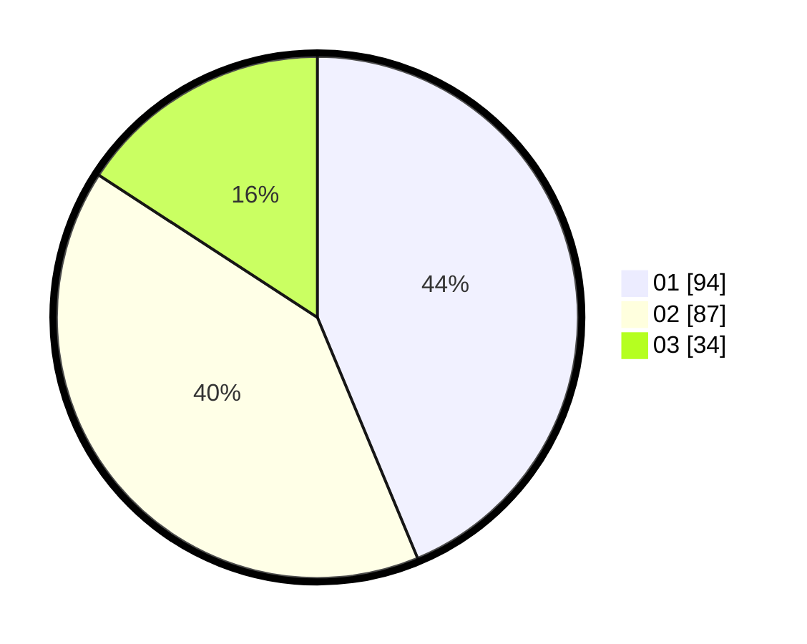

# Hasil

Hasil perolehan suara paslon dapat dilihat pada file paslon-01.txt, paslon-02.txt, dan paslon-03.txt.

Jika tidak ada, artinya data tersebut belum ada pada SIREKAP.

## Perolehan Suara

 * Paslon 01: **94**.
 * Paslon 02: **87**.
 * Paslon 03: **34**.

## Foto C Plano

https://sirekap-obj-formc.kpu.go.id/efaa/pemilu/ppwp/31/75/10/10/02/3175101002072-20240216-005228--7c7bdeac-4cc3-4382-93e9-3bbc1132923b.jpg

https://sirekap-obj-formc.kpu.go.id/efaa/pemilu/ppwp/31/75/10/10/02/3175101002072-20240216-005229--0e494992-47a3-441f-a584-226e04e32fa1.jpg

https://sirekap-obj-formc.kpu.go.id/efaa/pemilu/ppwp/31/75/10/10/02/3175101002072-20240216-005229--3e1ca010-0b63-4ae2-8ac1-a3f302d850b4.jpg

## DATA PEMILIH TETAP

Jumlah pemilih dalam DPT: **261**.
 * L: **131**.
 * P: **130**.

## DATA PENGGUNA HAK PILIH

Jumlah pengguna hak pilih dalam DPT: **217**.
 * L: **108**.
 * P: **109**.

Jumlah pengguna hak pilih dalam DPTb: **2**.
 * L: **0**.
 * P: **2**.

Jumlah pengguna hak pilih dalam DPK: **0**.
 * L: **0**.
 * P: **0**.

Jumlah pengguna hak pilih: **219**.
 * L: **108**.
 * P: **111**.

## JUMLAH SUARA SAH DAN TIDAK SAH

JUMLAH SELURUH SUARA SAH: **215**.

JUMLAH SUARA TIDAK SAH: **4**.

JUMLAH SELURUH SUARA SAH DAN SUARA TIDAK SAH: **219**.
