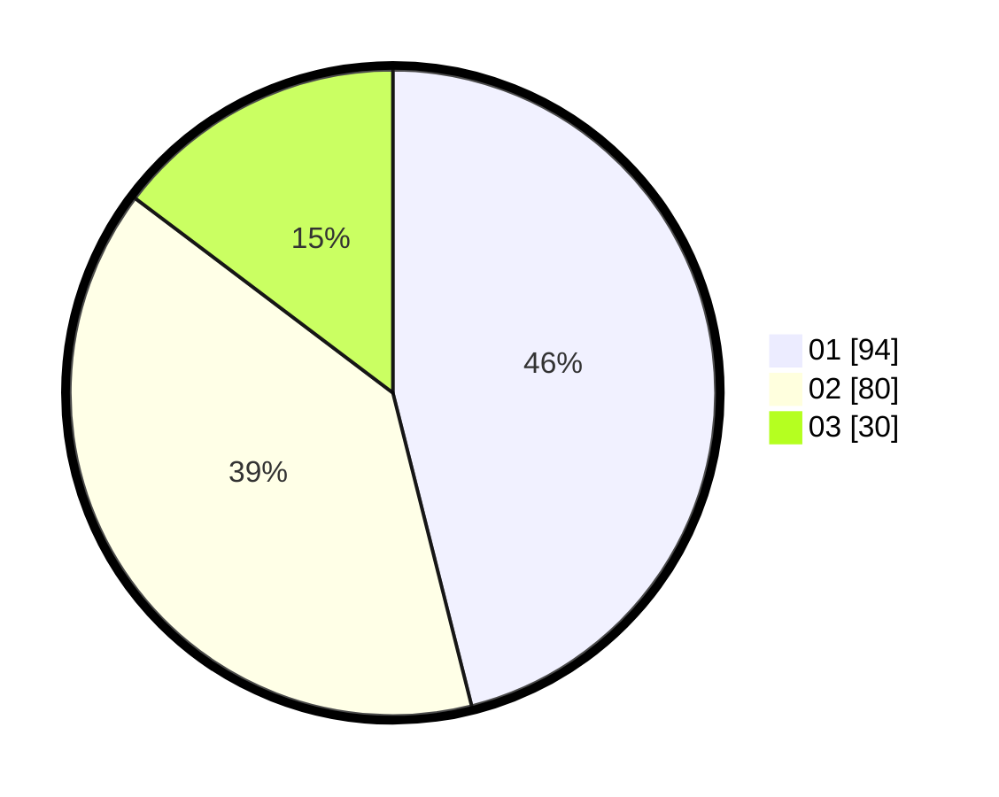

# Hasil

Hasil perolehan suara paslon dapat dilihat pada file paslon-01.txt, paslon-02.txt, dan paslon-03.txt.

Jika tidak ada, artinya data tersebut belum ada pada SIREKAP.

## Perolehan Suara

 * Paslon 01: **94**.
 * Paslon 02: **80**.
 * Paslon 03: **30**.

## Foto C Plano

https://sirekap-obj-formc.kpu.go.id/d6aa/pemilu/ppwp/31/75/10/10/02/3175101002073-20240214-155051--2ac55cc9-9c6d-4419-bdd2-2346dddad955.jpg

https://sirekap-obj-formc.kpu.go.id/d6aa/pemilu/ppwp/31/75/10/10/02/3175101002073-20240214-155102--b4c50bc0-87b1-4363-a728-95344c03b9a5.jpg

https://sirekap-obj-formc.kpu.go.id/d6aa/pemilu/ppwp/31/75/10/10/02/3175101002073-20240214-160054--3304a9c7-359f-4064-b70b-84eb0b5a914c.jpg

## DATA PEMILIH TETAP

Jumlah pemilih dalam DPT: **269**.
 * L: **137**.
 * P: **132**.

## DATA PENGGUNA HAK PILIH

Jumlah pengguna hak pilih dalam DPT: **204**.
 * L: **100**.
 * P: **104**.

Jumlah pengguna hak pilih dalam DPTb: **0**.
 * L: **0**.
 * P: **0**.

Jumlah pengguna hak pilih dalam DPK: **1**.
 * L: **1**.
 * P: **0**.

Jumlah pengguna hak pilih: **205**.
 * L: **101**.
 * P: **104**.

## JUMLAH SUARA SAH DAN TIDAK SAH

JUMLAH SELURUH SUARA SAH: **204**.

JUMLAH SUARA TIDAK SAH: **1**.

JUMLAH SELURUH SUARA SAH DAN SUARA TIDAK SAH: **205**.
