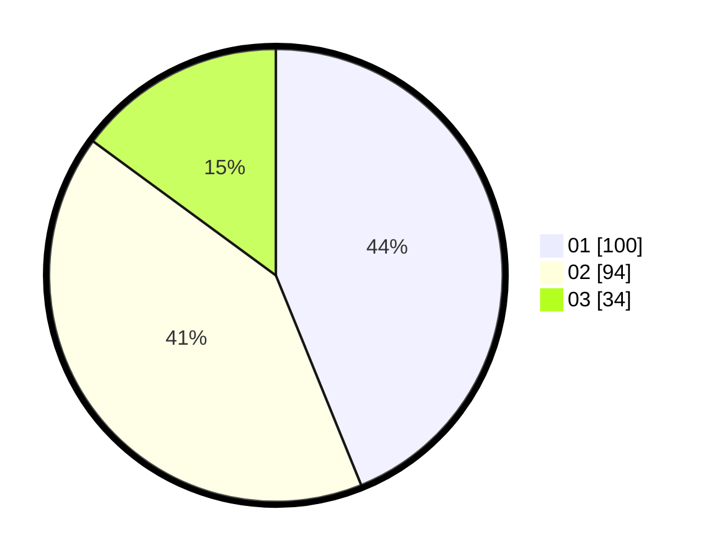

# Hasil

Hasil perolehan suara paslon dapat dilihat pada file paslon-01.txt, paslon-02.txt, dan paslon-03.txt.

Jika tidak ada, artinya data tersebut belum ada pada SIREKAP.

## Perolehan Suara

 * Paslon 01: **100**.
 * Paslon 02: **94**.
 * Paslon 03: **34**.

## Foto C Plano

https://sirekap-obj-formc.kpu.go.id/f8eb/pemilu/ppwp/31/75/10/10/02/3175101002092-20240215-225202--ad917bdd-f4fe-4b8f-86be-05ee8886b209.jpg

https://sirekap-obj-formc.kpu.go.id/f8eb/pemilu/ppwp/31/75/10/10/02/3175101002092-20240215-225206--0f53daf5-c239-4a78-a5ed-d071a9233934.jpg

https://sirekap-obj-formc.kpu.go.id/f8eb/pemilu/ppwp/31/75/10/10/02/3175101002092-20240215-225204--1b6abf00-1d4f-418f-8ae6-2c811b7c586b.jpg

## DATA PEMILIH TETAP

Jumlah pemilih dalam DPT: **272**.
 * L: **145**.
 * P: **127**.

## DATA PENGGUNA HAK PILIH

Jumlah pengguna hak pilih dalam DPT: **229**.
 * L: **128**.
 * P: **101**.

Jumlah pengguna hak pilih dalam DPTb: **4**.
 * L: **1**.
 * P: **3**.

Jumlah pengguna hak pilih dalam DPK: **1**.
 * L: **1**.
 * P: **0**.

Jumlah pengguna hak pilih: **234**.
 * L: **130**.
 * P: **104**.

## JUMLAH SUARA SAH DAN TIDAK SAH

JUMLAH SELURUH SUARA SAH: **228**.

JUMLAH SUARA TIDAK SAH: **6**.

JUMLAH SELURUH SUARA SAH DAN SUARA TIDAK SAH: **234**.
