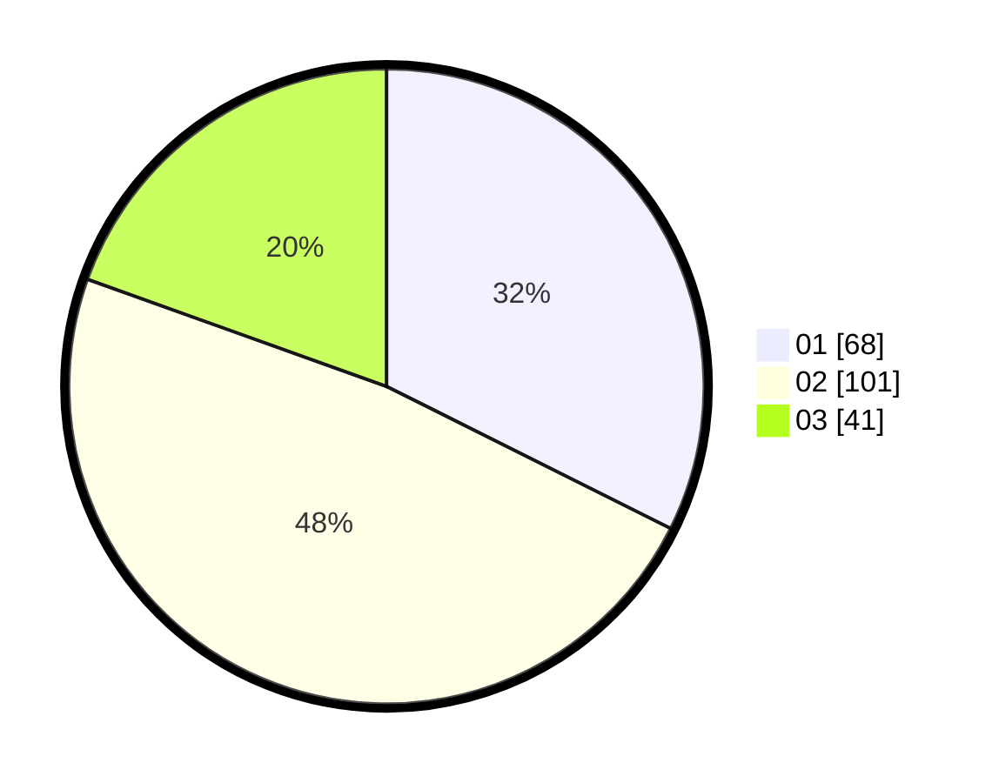

# Hasil

Hasil perolehan suara paslon dapat dilihat pada file paslon-01.txt, paslon-02.txt, dan paslon-03.txt.

Jika tidak ada, artinya data tersebut belum ada pada SIREKAP.

## Perolehan Suara

 * Paslon 01: **68**.
 * Paslon 02: **101**.
 * Paslon 03: **41**.

## Foto C Plano

https://sirekap-obj-formc.kpu.go.id/706e/pemilu/ppwp/31/75/10/10/02/3175101002093-20240214-235147--dddda4fe-db3a-45aa-90ad-df789fe6c3fd.jpg

https://sirekap-obj-formc.kpu.go.id/706e/pemilu/ppwp/31/75/10/10/02/3175101002093-20240214-235314--75cbf133-708a-4a55-bf7d-9b0064a789a7.jpg

https://sirekap-obj-formc.kpu.go.id/706e/pemilu/ppwp/31/75/10/10/02/3175101002093-20240214-235422--f1d4a370-0ef0-4b50-a252-3606070cb2d3.jpg
