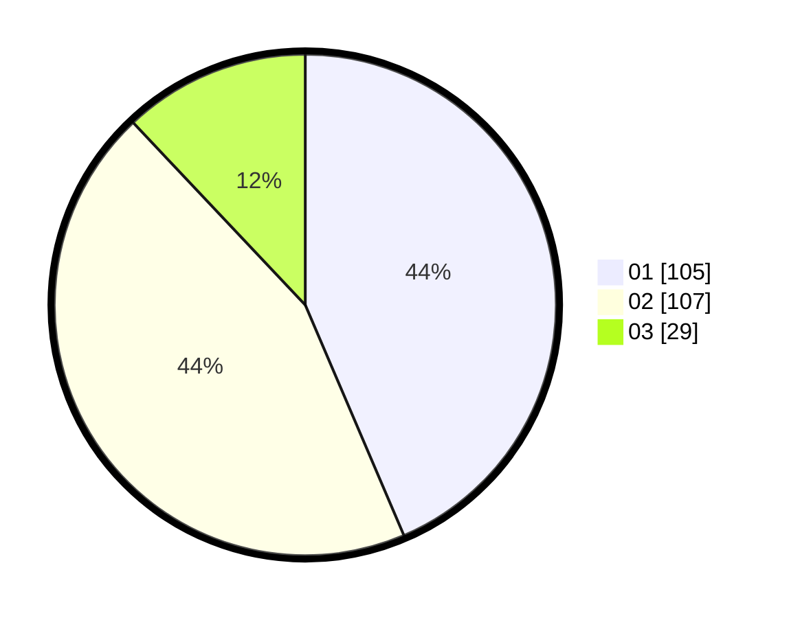

# Hasil

Hasil perolehan suara paslon dapat dilihat pada file paslon-01.txt, paslon-02.txt, dan paslon-03.txt.

Jika tidak ada, artinya data tersebut belum ada pada SIREKAP.

## Perolehan Suara

 * Paslon 01: **105**.
 * Paslon 02: **107**.
 * Paslon 03: **29**.

## Foto C Plano

https://sirekap-obj-formc.kpu.go.id/9440/pemilu/ppwp/31/75/10/10/03/3175101003002-20240214-193945--4cef7da2-3d01-4d7d-9a33-1e3d54058222.jpg

https://sirekap-obj-formc.kpu.go.id/9440/pemilu/ppwp/31/75/10/10/03/3175101003002-20240214-194003--2c100880-a732-4151-a186-2a8369163f4d.jpg

https://sirekap-obj-formc.kpu.go.id/9440/pemilu/ppwp/31/75/10/10/03/3175101003002-20240214-194009--2bb37abd-4f25-4eb6-be06-ef15db98b673.jpg

## DATA PEMILIH TETAP

Jumlah pemilih dalam DPT: **289**.
 * L: **145**.
 * P: **144**.

## DATA PENGGUNA HAK PILIH

Jumlah pengguna hak pilih dalam DPT: **240**.
 * L: **114**.
 * P: **126**.

Jumlah pengguna hak pilih dalam DPTb: **1**.
 * L: **1**.
 * P: **0**.

Jumlah pengguna hak pilih dalam DPK: **5**.
 * L: **2**.
 * P: **3**.

Jumlah pengguna hak pilih: **246**.
 * L: **117**.
 * P: **129**.

## JUMLAH SUARA SAH DAN TIDAK SAH

JUMLAH SELURUH SUARA SAH: **241**.

JUMLAH SUARA TIDAK SAH: **5**.

JUMLAH SELURUH SUARA SAH DAN SUARA TIDAK SAH: **246**.
