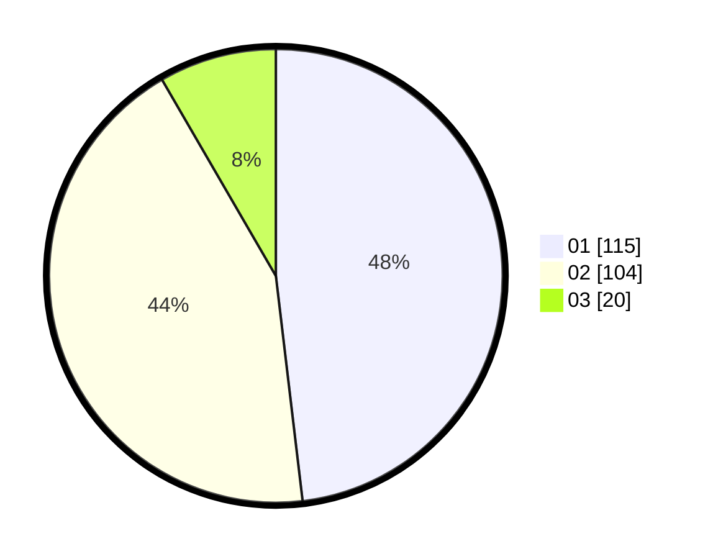

# Hasil

Hasil perolehan suara paslon dapat dilihat pada file paslon-01.txt, paslon-02.txt, dan paslon-03.txt.

Jika tidak ada, artinya data tersebut belum ada pada SIREKAP.

## Perolehan Suara

 * Paslon 01: **115**.
 * Paslon 02: **104**.
 * Paslon 03: **20**.

## Foto C Plano

https://sirekap-obj-formc.kpu.go.id/06ad/pemilu/ppwp/31/75/10/10/03/3175101003004-20240219-065919--d62ce392-cc02-4140-9798-12e38d508d1d.jpg

https://sirekap-obj-formc.kpu.go.id/06ad/pemilu/ppwp/31/75/10/10/03/3175101003004-20240219-065921--7cfe7d46-debe-4a16-a015-ed1cf1e0f3db.jpg

https://sirekap-obj-formc.kpu.go.id/06ad/pemilu/ppwp/31/75/10/10/03/3175101003004-20240219-065920--8fb96265-5abb-45c8-8c82-e9f24a26a5b9.jpg

## DATA PEMILIH TETAP

Jumlah pemilih dalam DPT: **280**.
 * L: **135**.
 * P: **145**.

## DATA PENGGUNA HAK PILIH

Jumlah pengguna hak pilih dalam DPT: **237**.
 * L: **111**.
 * P: **126**.

Jumlah pengguna hak pilih dalam DPTb: **1**.
 * L: **1**.
 * P: **0**.

Jumlah pengguna hak pilih dalam DPK: **5**.
 * L: **2**.
 * P: **3**.

Jumlah pengguna hak pilih: **243**.
 * L: **114**.
 * P: **129**.

## JUMLAH SUARA SAH DAN TIDAK SAH

JUMLAH SELURUH SUARA SAH: **239**.

JUMLAH SUARA TIDAK SAH: **4**.

JUMLAH SELURUH SUARA SAH DAN SUARA TIDAK SAH: **243**.
