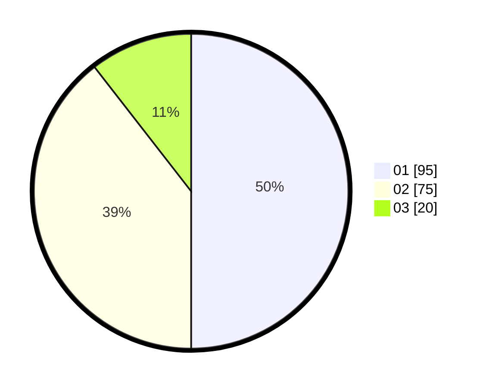

# Hasil

Hasil perolehan suara paslon dapat dilihat pada file paslon-01.txt, paslon-02.txt, dan paslon-03.txt.

Jika tidak ada, artinya data tersebut belum ada pada SIREKAP.

## Perolehan Suara

 * Paslon 01: **95**.
 * Paslon 02: **75**.
 * Paslon 03: **20**.

## Foto C Plano

https://sirekap-obj-formc.kpu.go.id/4f1d/pemilu/ppwp/31/75/10/10/03/3175101003009-20240214-200757--e16a6e36-da8f-4143-a1c0-6a15ff506d09.jpg

https://sirekap-obj-formc.kpu.go.id/4f1d/pemilu/ppwp/31/75/10/10/03/3175101003009-20240214-185030--bbc5a85f-169b-40d6-95d3-dc6854b5bf63.jpg

https://sirekap-obj-formc.kpu.go.id/4f1d/pemilu/ppwp/31/75/10/10/03/3175101003009-20240214-190037--6b071ff2-c02d-471f-9f25-a80d16882ad5.jpg
