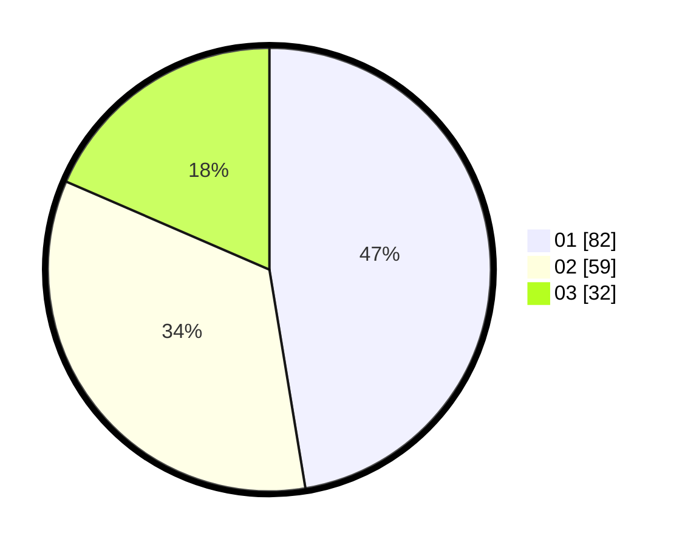

# Hasil

Hasil perolehan suara paslon dapat dilihat pada file paslon-01.txt, paslon-02.txt, dan paslon-03.txt.

Jika tidak ada, artinya data tersebut belum ada pada SIREKAP.

## Perolehan Suara

 * Paslon 01: **82**.
 * Paslon 02: **59**.
 * Paslon 03: **32**.

## Foto C Plano

https://sirekap-obj-formc.kpu.go.id/3cd2/pemilu/ppwp/31/75/10/10/03/3175101003014-20240214-155633--63c1d621-cb05-4651-ba46-935de9c6af9b.jpg

https://sirekap-obj-formc.kpu.go.id/3cd2/pemilu/ppwp/31/75/10/10/03/3175101003014-20240214-155355--c539a0c7-fa4b-4f06-805f-a4b15a59625b.jpg

https://sirekap-obj-formc.kpu.go.id/3cd2/pemilu/ppwp/31/75/10/10/03/3175101003014-20240214-155508--0598a625-de17-441e-9a28-daac181e63a5.jpg
