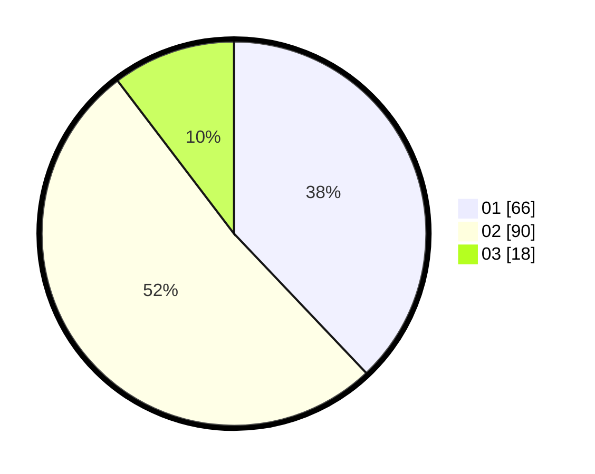

# Hasil

Hasil perolehan suara paslon dapat dilihat pada file paslon-01.txt, paslon-02.txt, dan paslon-03.txt.

Jika tidak ada, artinya data tersebut belum ada pada SIREKAP.

## Perolehan Suara

 * Paslon 01: **66**.
 * Paslon 02: **90**.
 * Paslon 03: **18**.

## Foto C Plano

https://sirekap-obj-formc.kpu.go.id/506c/pemilu/ppwp/31/75/10/10/03/3175101003015-20240214-220616--649d1a49-ad22-40ec-be37-771244153742.jpg

https://sirekap-obj-formc.kpu.go.id/506c/pemilu/ppwp/31/75/10/10/03/3175101003015-20240214-220203--820163cd-630c-4dd4-8d43-c9171a3438fa.jpg

https://sirekap-obj-formc.kpu.go.id/506c/pemilu/ppwp/31/75/10/10/03/3175101003015-20240214-221858--89f02d75-800d-4096-85bb-4b5aa0e1d6fd.jpg
