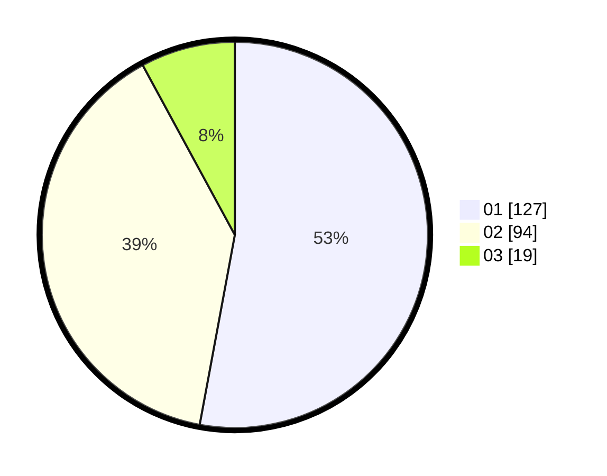

# Hasil

Hasil perolehan suara paslon dapat dilihat pada file paslon-01.txt, paslon-02.txt, dan paslon-03.txt.

Jika tidak ada, artinya data tersebut belum ada pada SIREKAP.

## Perolehan Suara

 * Paslon 01: **127**.
 * Paslon 02: **94**.
 * Paslon 03: **19**.

## Foto C Plano

https://sirekap-obj-formc.kpu.go.id/1966/pemilu/ppwp/31/75/10/10/03/3175101003037-20240214-191738--5a8db993-219e-493f-9058-0dc9bd0e5e4c.jpg

https://sirekap-obj-formc.kpu.go.id/1966/pemilu/ppwp/31/75/10/10/03/3175101003037-20240214-192210--557a0128-f865-4765-ad35-c3cc6d81f4d1.jpg

https://sirekap-obj-formc.kpu.go.id/1966/pemilu/ppwp/31/75/10/10/03/3175101003037-20240214-192528--afde3a80-7e99-4b25-9be6-6d52bb46b380.jpg

## DATA PEMILIH TETAP

Jumlah pemilih dalam DPT: **262**.
 * L: **125**.
 * P: **137**.

## DATA PENGGUNA HAK PILIH

Jumlah pengguna hak pilih dalam DPT: **262**.
 * L: **125**.
 * P: **137**.

Jumlah pengguna hak pilih dalam DPTb: **8**.
 * L: **2**.
 * P: **6**.

Jumlah pengguna hak pilih dalam DPK: **0**.
 * L: **0**.
 * P: **0**.

Jumlah pengguna hak pilih: **270**.
 * L: **127**.
 * P: **143**.

## JUMLAH SUARA SAH DAN TIDAK SAH

JUMLAH SELURUH SUARA SAH: **240**.

JUMLAH SUARA TIDAK SAH: **3**.

JUMLAH SELURUH SUARA SAH DAN SUARA TIDAK SAH: **243**.
