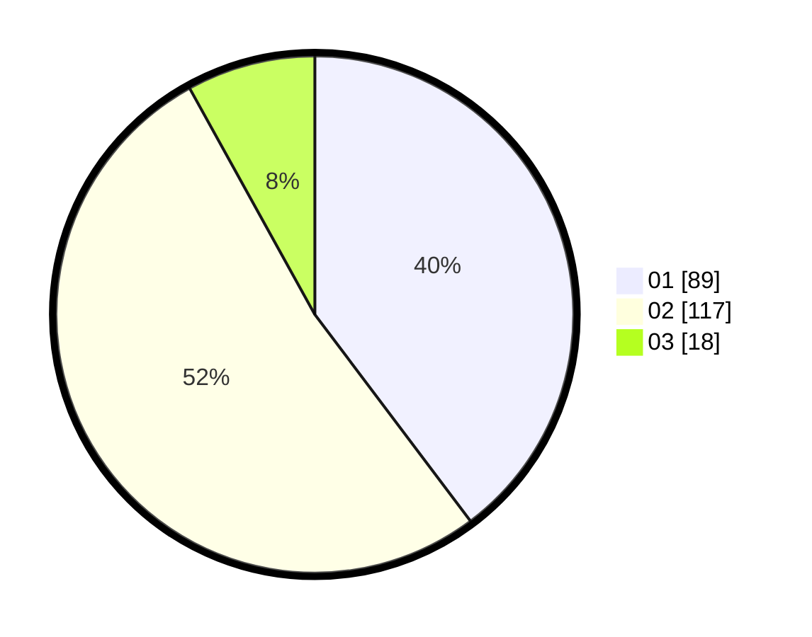

# Hasil

Hasil perolehan suara paslon dapat dilihat pada file paslon-01.txt, paslon-02.txt, dan paslon-03.txt.

Jika tidak ada, artinya data tersebut belum ada pada SIREKAP.

## Perolehan Suara

 * Paslon 01: **89**.
 * Paslon 02: **117**.
 * Paslon 03: **18**.

## Foto C Plano

https://sirekap-obj-formc.kpu.go.id/ff93/pemilu/ppwp/31/75/10/10/03/3175101003038-20240214-213304--02b1429c-4cbb-4ae1-8459-cbb8769adb95.jpg

https://sirekap-obj-formc.kpu.go.id/ff93/pemilu/ppwp/31/75/10/10/03/3175101003038-20240214-213637--781c5dea-0a77-4c09-8b31-b9558ce95055.jpg

https://sirekap-obj-formc.kpu.go.id/ff93/pemilu/ppwp/31/75/10/10/03/3175101003038-20240214-213414--30c3fab0-8a49-4270-ac07-cefe83ef7ac9.jpg

## DATA PEMILIH TETAP

Jumlah pemilih dalam DPT: **267**.
 * L: **131**.
 * P: **136**.

## DATA PENGGUNA HAK PILIH

Jumlah pengguna hak pilih dalam DPT: **212**.
 * L: **101**.
 * P: **111**.

Jumlah pengguna hak pilih dalam DPTb: **10**.
 * L: **3**.
 * P: **7**.

Jumlah pengguna hak pilih dalam DPK: **7**.
 * L: **4**.
 * P: **3**.

Jumlah pengguna hak pilih: **229**.
 * L: **108**.
 * P: **121**.

## JUMLAH SUARA SAH DAN TIDAK SAH

JUMLAH SELURUH SUARA SAH: **224**.

JUMLAH SUARA TIDAK SAH: **5**.

JUMLAH SELURUH SUARA SAH DAN SUARA TIDAK SAH: **229**.
