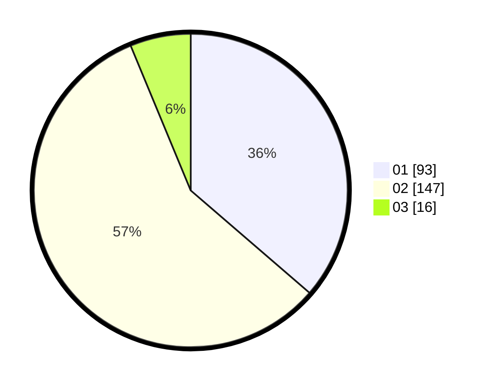

# Hasil

Hasil perolehan suara paslon dapat dilihat pada file paslon-01.txt, paslon-02.txt, dan paslon-03.txt.

Jika tidak ada, artinya data tersebut belum ada pada SIREKAP.

## Perolehan Suara

 * Paslon 01: **93**.
 * Paslon 02: **147**.
 * Paslon 03: **16**.

## Foto C Plano

https://sirekap-obj-formc.kpu.go.id/c85d/pemilu/ppwp/31/75/10/10/03/3175101003044-20240214-194337--3286583a-e391-41c7-aa17-827c3bd470d9.jpg

https://sirekap-obj-formc.kpu.go.id/c85d/pemilu/ppwp/31/75/10/10/03/3175101003044-20240214-194400--cd306af0-6ef9-4f7e-90f8-345d2a406adb.jpg

https://sirekap-obj-formc.kpu.go.id/c85d/pemilu/ppwp/31/75/10/10/03/3175101003044-20240214-194413--4fba45d1-4b49-450a-bec9-53234d1ed97e.jpg
