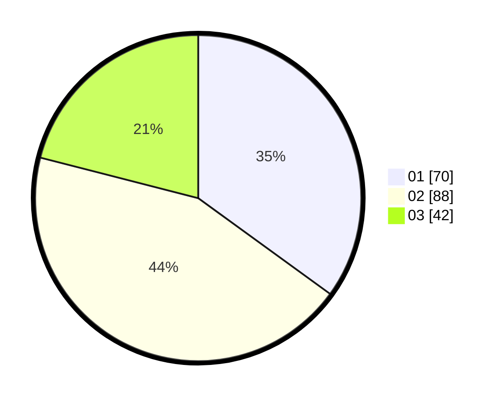

# Hasil

Hasil perolehan suara paslon dapat dilihat pada file paslon-01.txt, paslon-02.txt, dan paslon-03.txt.

Jika tidak ada, artinya data tersebut belum ada pada SIREKAP.

## Perolehan Suara

 * Paslon 01: **70**.
 * Paslon 02: **88**.
 * Paslon 03: **42**.

## Foto C Plano

https://sirekap-obj-formc.kpu.go.id/46d8/pemilu/ppwp/31/75/10/10/03/3175101003059-20240214-184855--4838a2c2-7a29-4020-aa76-f8ccd846a388.jpg

https://sirekap-obj-formc.kpu.go.id/46d8/pemilu/ppwp/31/75/10/10/03/3175101003059-20240214-222116--0386e62f-3021-426d-ae8a-1e30a9c5a42e.jpg

https://sirekap-obj-formc.kpu.go.id/46d8/pemilu/ppwp/31/75/10/10/03/3175101003059-20240214-221913--53f334df-f084-4f37-a38a-ea7cf78a7ab2.jpg
