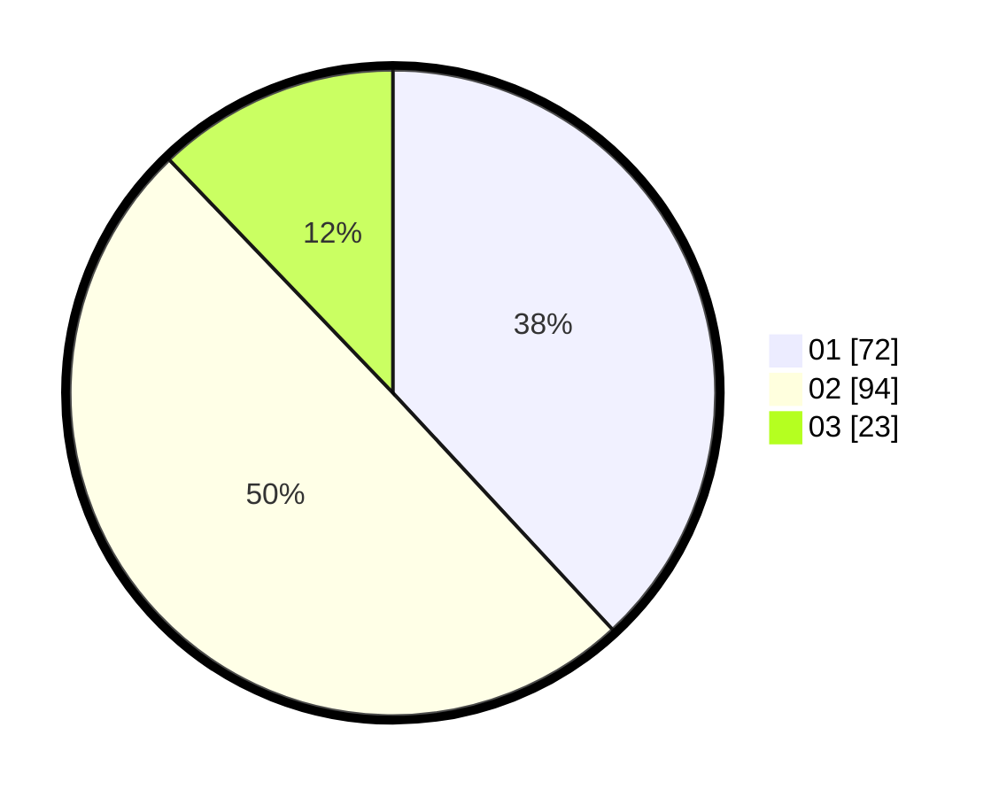

# Hasil

Hasil perolehan suara paslon dapat dilihat pada file paslon-01.txt, paslon-02.txt, dan paslon-03.txt.

Jika tidak ada, artinya data tersebut belum ada pada SIREKAP.

## Perolehan Suara

 * Paslon 01: **72**.
 * Paslon 02: **94**.
 * Paslon 03: **23**.

## Foto C Plano

https://sirekap-obj-formc.kpu.go.id/ca5c/pemilu/ppwp/31/75/10/10/03/3175101003068-20240214-220854--7386d4f6-e826-48f7-a3bd-6190eccca910.jpg

https://sirekap-obj-formc.kpu.go.id/ca5c/pemilu/ppwp/31/75/10/10/03/3175101003068-20240214-234957--84c268be-0875-4718-b1a4-ecbd759bc0fe.jpg

https://sirekap-obj-formc.kpu.go.id/ca5c/pemilu/ppwp/31/75/10/10/03/3175101003068-20240214-235133--c9048841-8b1b-4b41-985b-868fa3ecfa59.jpg
