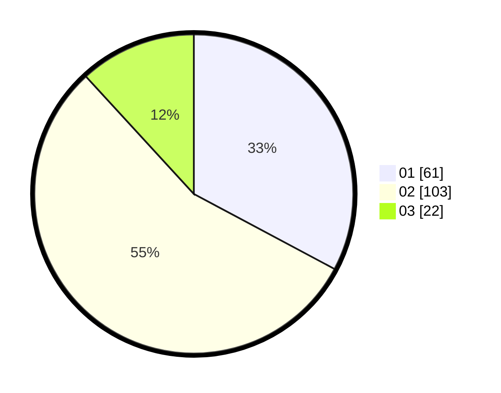

# Hasil

Hasil perolehan suara paslon dapat dilihat pada file paslon-01.txt, paslon-02.txt, dan paslon-03.txt.

Jika tidak ada, artinya data tersebut belum ada pada SIREKAP.

## Perolehan Suara

 * Paslon 01: **61**.
 * Paslon 02: **103**.
 * Paslon 03: **22**.

## Foto C Plano

https://sirekap-obj-formc.kpu.go.id/8cfc/pemilu/ppwp/31/75/10/10/03/3175101003070-20240215-022138--60630374-abe1-44cb-ab4f-77af459991c7.jpg

https://sirekap-obj-formc.kpu.go.id/8cfc/pemilu/ppwp/31/75/10/10/03/3175101003070-20240215-022145--5f76320e-9b20-4f1a-b86b-bc02e451f1d6.jpg

https://sirekap-obj-formc.kpu.go.id/8cfc/pemilu/ppwp/31/75/10/10/03/3175101003070-20240215-022151--42563ec9-db4c-4cb6-8342-f6db01a839a5.jpg
