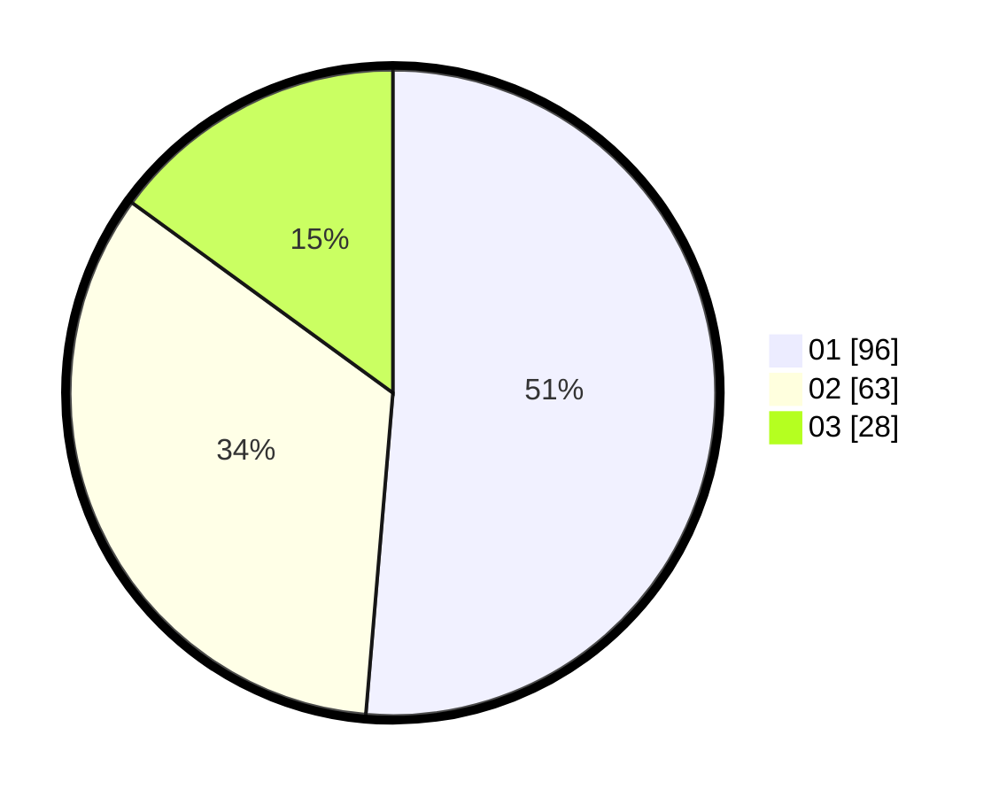

# Hasil

Hasil perolehan suara paslon dapat dilihat pada file paslon-01.txt, paslon-02.txt, dan paslon-03.txt.

Jika tidak ada, artinya data tersebut belum ada pada SIREKAP.

## Perolehan Suara

 * Paslon 01: **96**.
 * Paslon 02: **63**.
 * Paslon 03: **28**.

## Foto C Plano

https://sirekap-obj-formc.kpu.go.id/4ac7/pemilu/ppwp/31/75/10/10/03/3175101003071-20240214-231648--780c5e2c-7c62-423a-ae6d-ebf4a837eaf1.jpg

https://sirekap-obj-formc.kpu.go.id/4ac7/pemilu/ppwp/31/75/10/10/03/3175101003071-20240214-231800--1de9ff3e-bcc1-4b2f-9001-df716937504a.jpg

https://sirekap-obj-formc.kpu.go.id/4ac7/pemilu/ppwp/31/75/10/10/03/3175101003071-20240214-231917--768d05c3-00c3-4b73-b32d-c1c49f325780.jpg
