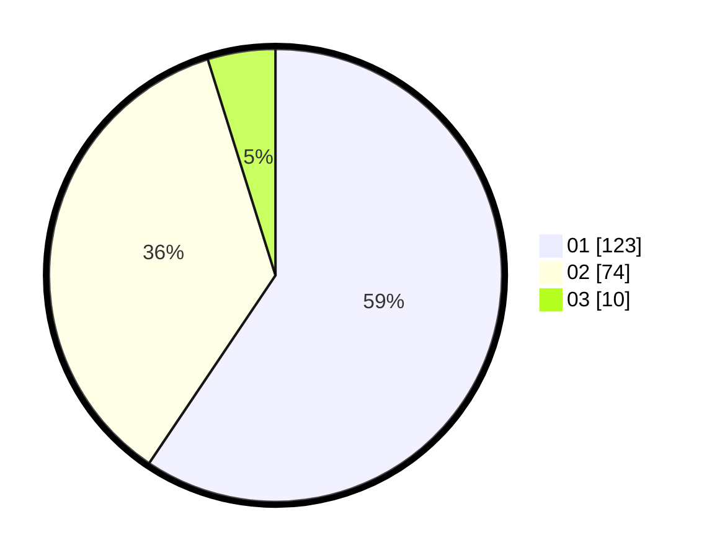

# Hasil

Hasil perolehan suara paslon dapat dilihat pada file paslon-01.txt, paslon-02.txt, dan paslon-03.txt.

Jika tidak ada, artinya data tersebut belum ada pada SIREKAP.

## Perolehan Suara

 * Paslon 01: **123**.
 * Paslon 02: **74**.
 * Paslon 03: **10**.

## Foto C Plano

https://sirekap-obj-formc.kpu.go.id/286f/pemilu/ppwp/31/75/10/10/03/3175101003073-20240214-213606--dcb5a009-67ff-430e-bb73-d65b4b124d13.jpg

https://sirekap-obj-formc.kpu.go.id/286f/pemilu/ppwp/31/75/10/10/03/3175101003073-20240214-213838--db12538b-f8c9-41ae-820d-ad8144069bc6.jpg

https://sirekap-obj-formc.kpu.go.id/286f/pemilu/ppwp/31/75/10/10/03/3175101003073-20240214-223947--3e4b9265-90c6-4d07-afcf-54375e9c66b9.jpg
