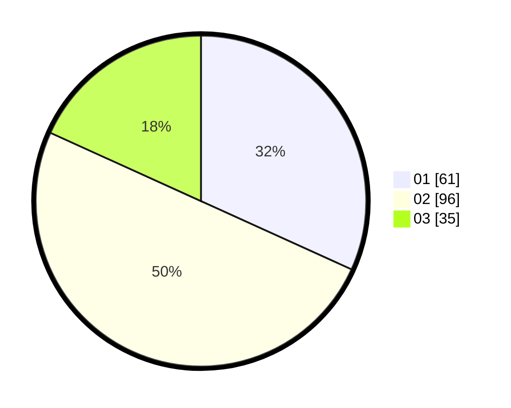

# Hasil

Hasil perolehan suara paslon dapat dilihat pada file paslon-01.txt, paslon-02.txt, dan paslon-03.txt.

Jika tidak ada, artinya data tersebut belum ada pada SIREKAP.

## Perolehan Suara

 * Paslon 01: **61**.
 * Paslon 02: **96**.
 * Paslon 03: **35**.

## Foto C Plano

https://sirekap-obj-formc.kpu.go.id/e1f4/pemilu/ppwp/31/75/10/10/03/3175101003089-20240214-212102--170ae2cb-5d9f-4a19-85fc-20bc01a11a81.jpg

https://sirekap-obj-formc.kpu.go.id/e1f4/pemilu/ppwp/31/75/10/10/03/3175101003089-20240214-212237--7d45b2e0-9af1-4e16-9311-f1bc83124a58.jpg

https://sirekap-obj-formc.kpu.go.id/e1f4/pemilu/ppwp/31/75/10/10/03/3175101003089-20240214-212426--24c5b236-c396-45e2-8c2c-13513b6d4ba0.jpg
