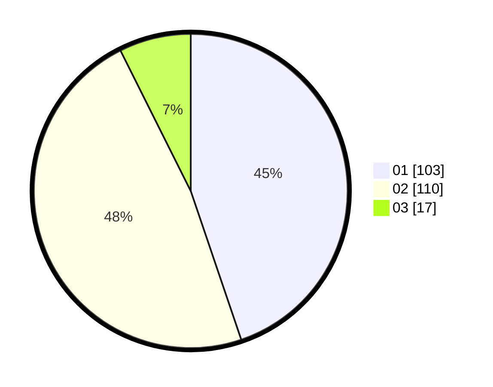

# Hasil

Hasil perolehan suara paslon dapat dilihat pada file paslon-01.txt, paslon-02.txt, dan paslon-03.txt.

Jika tidak ada, artinya data tersebut belum ada pada SIREKAP.

## Perolehan Suara

 * Paslon 01: **103**.
 * Paslon 02: **110**.
 * Paslon 03: **17**.

## Foto C Plano

https://sirekap-obj-formc.kpu.go.id/381f/pemilu/ppwp/31/75/10/10/04/3175101004010-20240216-141703--a91ce8ad-8cc4-4f40-b45d-5aaddbf89302.jpg

https://sirekap-obj-formc.kpu.go.id/381f/pemilu/ppwp/31/75/10/10/04/3175101004010-20240216-141704--bf0909e0-3b0b-4653-a595-49480652871e.jpg

https://sirekap-obj-formc.kpu.go.id/381f/pemilu/ppwp/31/75/10/10/04/3175101004010-20240216-141703--c105da17-6036-4da1-b1be-68037ab18467.jpg

## DATA PEMILIH TETAP

Jumlah pemilih dalam DPT: **280**.
 * L: **137**.
 * P: **143**.

## DATA PENGGUNA HAK PILIH

Jumlah pengguna hak pilih dalam DPT: **229**.
 * L: **105**.
 * P: **124**.

Jumlah pengguna hak pilih dalam DPTb: **2**.
 * L: **1**.
 * P: **1**.

Jumlah pengguna hak pilih dalam DPK: **2**.
 * L: **1**.
 * P: **1**.

Jumlah pengguna hak pilih: **233**.
 * L: **107**.
 * P: **126**.

## JUMLAH SUARA SAH DAN TIDAK SAH

JUMLAH SELURUH SUARA SAH: **230**.

JUMLAH SUARA TIDAK SAH: **3**.

JUMLAH SELURUH SUARA SAH DAN SUARA TIDAK SAH: **233**.
