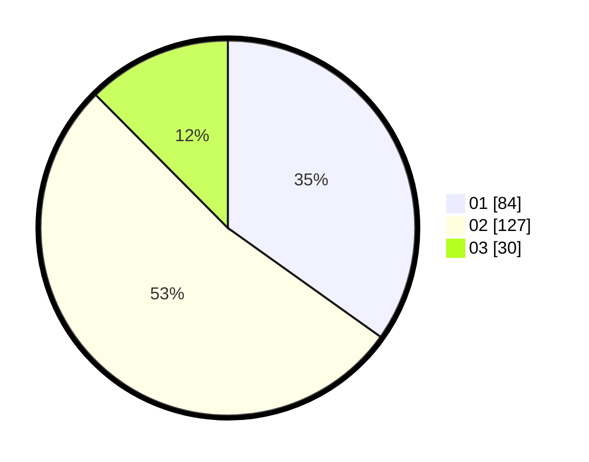

# Hasil

Hasil perolehan suara paslon dapat dilihat pada file paslon-01.txt, paslon-02.txt, dan paslon-03.txt.

Jika tidak ada, artinya data tersebut belum ada pada SIREKAP.

## Perolehan Suara

 * Paslon 01: **84**.
 * Paslon 02: **127**.
 * Paslon 03: **30**.

## Foto C Plano

https://sirekap-obj-formc.kpu.go.id/550e/pemilu/ppwp/31/75/10/10/04/3175101004025-20240216-024011--295a8b68-6a2c-459e-bbeb-8c0bc7d81f2d.jpg

https://sirekap-obj-formc.kpu.go.id/550e/pemilu/ppwp/31/75/10/10/04/3175101004025-20240216-024029--ccd1c2af-17f5-43e2-b950-3350fd590e1c.jpg

https://sirekap-obj-formc.kpu.go.id/550e/pemilu/ppwp/31/75/10/10/04/3175101004025-20240216-024021--e3871a51-c1b9-4891-afbb-12171dc14a41.jpg

## DATA PEMILIH TETAP

Jumlah pemilih dalam DPT: **285**.
 * L: **127**.
 * P: **158**.

## DATA PENGGUNA HAK PILIH

Jumlah pengguna hak pilih dalam DPT: **240**.
 * L: **100**.
 * P: **140**.

Jumlah pengguna hak pilih dalam DPTb: **1**.
 * L: **1**.
 * P: **0**.

Jumlah pengguna hak pilih dalam DPK: **4**.
 * L: **2**.
 * P: **2**.

Jumlah pengguna hak pilih: **245**.
 * L: **103**.
 * P: **142**.

## JUMLAH SUARA SAH DAN TIDAK SAH

JUMLAH SELURUH SUARA SAH: **241**.

JUMLAH SUARA TIDAK SAH: **4**.

JUMLAH SELURUH SUARA SAH DAN SUARA TIDAK SAH: **245**.
