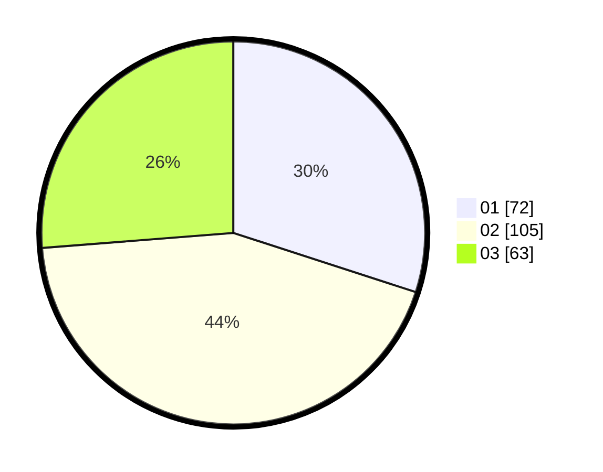

# Hasil

Hasil perolehan suara paslon dapat dilihat pada file paslon-01.txt, paslon-02.txt, dan paslon-03.txt.

Jika tidak ada, artinya data tersebut belum ada pada SIREKAP.

## Perolehan Suara

 * Paslon 01: **72**.
 * Paslon 02: **105**.
 * Paslon 03: **63**.

## Foto C Plano

https://sirekap-obj-formc.kpu.go.id/fc4a/pemilu/ppwp/31/75/10/10/04/3175101004027-20240214-205933--ba746df6-779c-4613-960b-b72cbc4cb87d.jpg

https://sirekap-obj-formc.kpu.go.id/fc4a/pemilu/ppwp/31/75/10/10/04/3175101004027-20240214-210041--2a498188-fc6a-492a-90ac-7fc7ecf2c119.jpg

https://sirekap-obj-formc.kpu.go.id/fc4a/pemilu/ppwp/31/75/10/10/04/3175101004027-20240214-210142--c53849d3-69ee-4c40-8be0-37f9adde4fb6.jpg

## DATA PEMILIH TETAP

Jumlah pemilih dalam DPT: **284**.
 * L: **111**.
 * P: **173**.

## DATA PENGGUNA HAK PILIH

Jumlah pengguna hak pilih dalam DPT: **240**.
 * L: **90**.
 * P: **150**.

Jumlah pengguna hak pilih dalam DPTb: **2**.
 * L: **1**.
 * P: **1**.

Jumlah pengguna hak pilih dalam DPK: **1**.
 * L: **1**.
 * P: **0**.

Jumlah pengguna hak pilih: **243**.
 * L: **92**.
 * P: **151**.

## JUMLAH SUARA SAH DAN TIDAK SAH

JUMLAH SELURUH SUARA SAH: **240**.

JUMLAH SUARA TIDAK SAH: **3**.

JUMLAH SELURUH SUARA SAH DAN SUARA TIDAK SAH: **243**.
