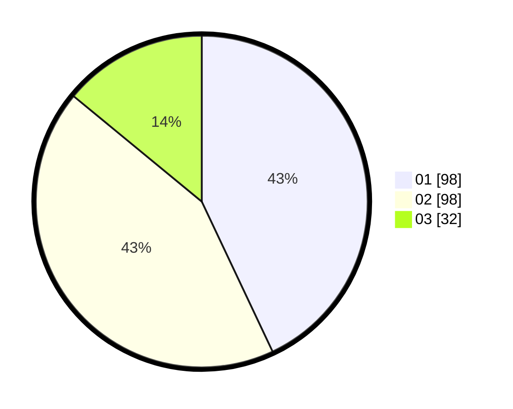

# Hasil

Hasil perolehan suara paslon dapat dilihat pada file paslon-01.txt, paslon-02.txt, dan paslon-03.txt.

Jika tidak ada, artinya data tersebut belum ada pada SIREKAP.

## Perolehan Suara

 * Paslon 01: **98**.
 * Paslon 02: **98**.
 * Paslon 03: **32**.

## Foto C Plano

https://sirekap-obj-formc.kpu.go.id/86f6/pemilu/ppwp/31/75/10/10/04/3175101004038-20240215-230711--844fb990-2f8b-4ccc-8038-4b0a2b26ef6d.jpg

https://sirekap-obj-formc.kpu.go.id/86f6/pemilu/ppwp/31/75/10/10/04/3175101004038-20240215-230713--86dad80a-1f59-422d-a1cf-e74701237718.jpg

https://sirekap-obj-formc.kpu.go.id/86f6/pemilu/ppwp/31/75/10/10/04/3175101004038-20240215-230712--40578333-173a-4253-8d51-1228af849ed1.jpg

## DATA PEMILIH TETAP

Jumlah pemilih dalam DPT: **278**.
 * L: **142**.
 * P: **136**.

## DATA PENGGUNA HAK PILIH

Jumlah pengguna hak pilih dalam DPT: **227**.
 * L: **115**.
 * P: **112**.

Jumlah pengguna hak pilih dalam DPTb: **0**.
 * L: **0**.
 * P: **0**.

Jumlah pengguna hak pilih dalam DPK: **1**.
 * L: **0**.
 * P: **1**.

Jumlah pengguna hak pilih: **228**.
 * L: **115**.
 * P: **113**.

## JUMLAH SUARA SAH DAN TIDAK SAH

JUMLAH SELURUH SUARA SAH: **228**.

JUMLAH SUARA TIDAK SAH: **0**.

JUMLAH SELURUH SUARA SAH DAN SUARA TIDAK SAH: **228**.
