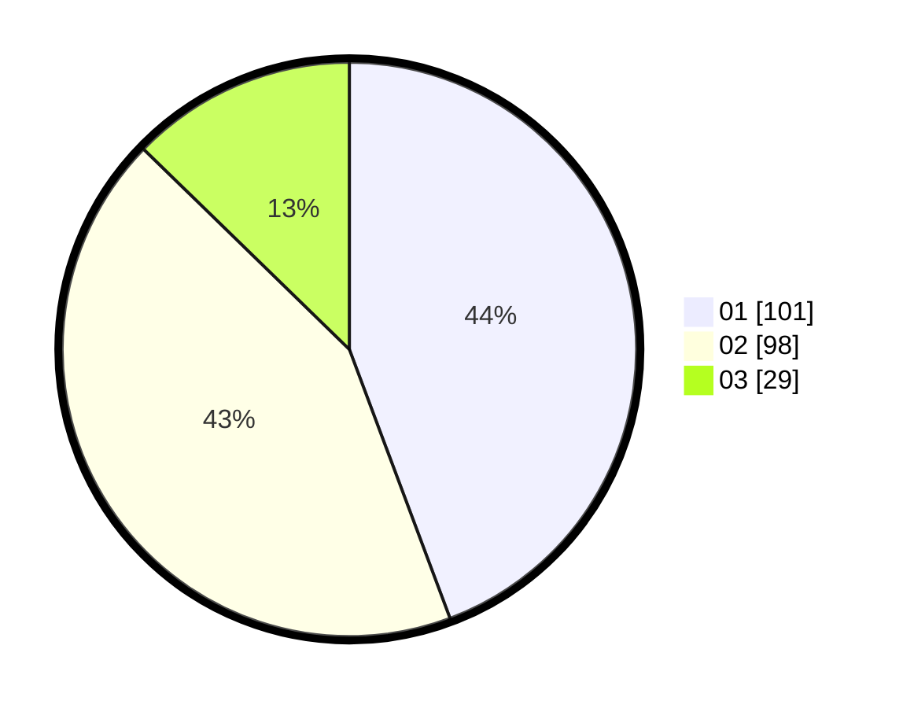

# Hasil

Hasil perolehan suara paslon dapat dilihat pada file paslon-01.txt, paslon-02.txt, dan paslon-03.txt.

Jika tidak ada, artinya data tersebut belum ada pada SIREKAP.

## Perolehan Suara

 * Paslon 01: **101**.
 * Paslon 02: **98**.
 * Paslon 03: **29**.

## Foto C Plano

https://sirekap-obj-formc.kpu.go.id/e2c1/pemilu/ppwp/31/75/10/10/04/3175101004044-20240216-083314--b5e3100b-49e2-43dc-aaf0-f60a4893337f.jpg

https://sirekap-obj-formc.kpu.go.id/e2c1/pemilu/ppwp/31/75/10/10/04/3175101004044-20240216-083318--5e158256-db40-46dd-b5b0-b56abde355f5.jpg

https://sirekap-obj-formc.kpu.go.id/e2c1/pemilu/ppwp/31/75/10/10/04/3175101004044-20240216-083315--4353def6-fb82-4cf9-a594-3958137a892a.jpg

## DATA PEMILIH TETAP

Jumlah pemilih dalam DPT: **0**.
 * L: **0**.
 * P: **0**.

## DATA PENGGUNA HAK PILIH

Jumlah pengguna hak pilih dalam DPT: **0**.
 * L: **0**.
 * P: **0**.

Jumlah pengguna hak pilih dalam DPTb: **0**.
 * L: **0**.
 * P: **0**.

Jumlah pengguna hak pilih dalam DPK: **0**.
 * L: **0**.
 * P: **0**.

Jumlah pengguna hak pilih: **0**.
 * L: **0**.
 * P: **0**.

## JUMLAH SUARA SAH DAN TIDAK SAH

JUMLAH SELURUH SUARA SAH: **228**.

JUMLAH SUARA TIDAK SAH: **1**.

JUMLAH SELURUH SUARA SAH DAN SUARA TIDAK SAH: **229**.
