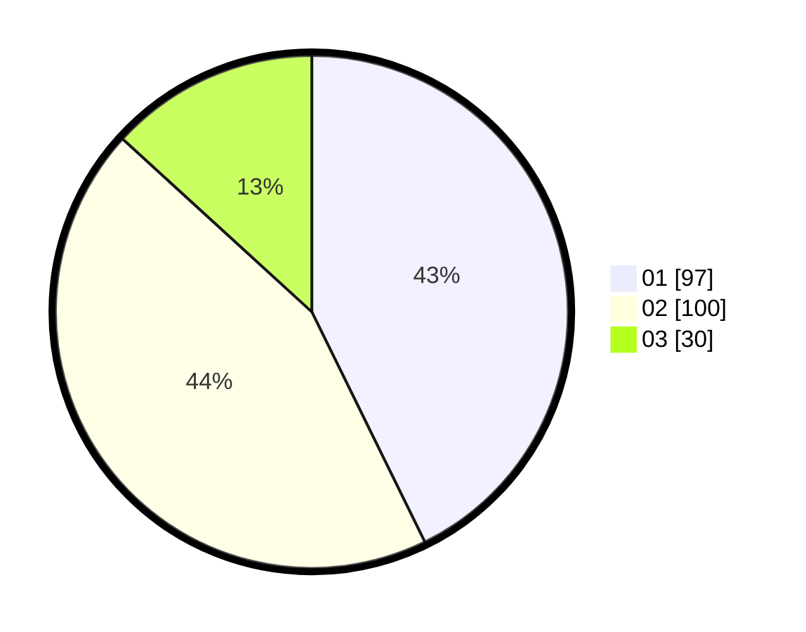

# Hasil

Hasil perolehan suara paslon dapat dilihat pada file paslon-01.txt, paslon-02.txt, dan paslon-03.txt.

Jika tidak ada, artinya data tersebut belum ada pada SIREKAP.

## Perolehan Suara

 * Paslon 01: **97**.
 * Paslon 02: **100**.
 * Paslon 03: **30**.

## Foto C Plano

https://sirekap-obj-formc.kpu.go.id/85b4/pemilu/ppwp/31/75/10/10/04/3175101004045-20240215-210636--3dae69fc-7e3e-4c59-986c-9aaca8a8c0e8.jpg

https://sirekap-obj-formc.kpu.go.id/85b4/pemilu/ppwp/31/75/10/10/04/3175101004045-20240215-210637--069eb4b6-ae06-4105-88a0-79cd0e505e42.jpg

https://sirekap-obj-formc.kpu.go.id/85b4/pemilu/ppwp/31/75/10/10/04/3175101004045-20240214-191938--5ba9582d-3c55-4a49-8d69-dfb73635972d.jpg

## DATA PEMILIH TETAP

Jumlah pemilih dalam DPT: **278**.
 * L: **135**.
 * P: **143**.

## DATA PENGGUNA HAK PILIH

Jumlah pengguna hak pilih dalam DPT: **227**.
 * L: **110**.
 * P: **117**.

Jumlah pengguna hak pilih dalam DPTb: **1**.
 * L: **1**.
 * P: **0**.

Jumlah pengguna hak pilih dalam DPK: **3**.
 * L: **0**.
 * P: **3**.

Jumlah pengguna hak pilih: **231**.
 * L: **111**.
 * P: **120**.

## JUMLAH SUARA SAH DAN TIDAK SAH

JUMLAH SELURUH SUARA SAH: **227**.

JUMLAH SUARA TIDAK SAH: **4**.

JUMLAH SELURUH SUARA SAH DAN SUARA TIDAK SAH: **231**.
