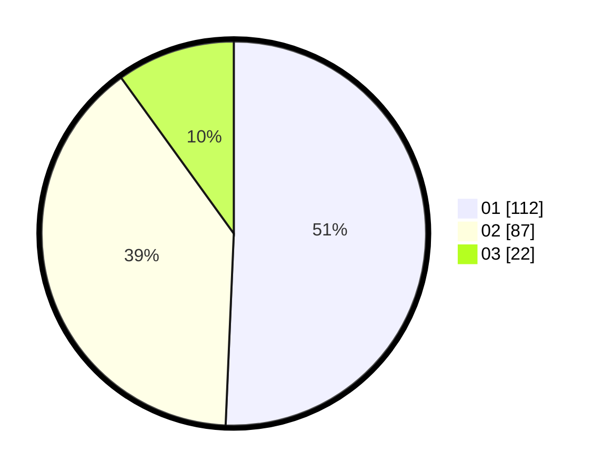

# Hasil

Hasil perolehan suara paslon dapat dilihat pada file paslon-01.txt, paslon-02.txt, dan paslon-03.txt.

Jika tidak ada, artinya data tersebut belum ada pada SIREKAP.

## Perolehan Suara

 * Paslon 01: **112**.
 * Paslon 02: **87**.
 * Paslon 03: **22**.

## Foto C Plano

https://sirekap-obj-formc.kpu.go.id/6da7/pemilu/ppwp/31/75/10/10/04/3175101004049-20240215-000551--f942e4a5-92e9-4fab-9bae-d6fae9bf74af.jpg

https://sirekap-obj-formc.kpu.go.id/6da7/pemilu/ppwp/31/75/10/10/04/3175101004049-20240214-235303--3408fc87-cf4d-42e3-b329-922bc5c26101.jpg

https://sirekap-obj-formc.kpu.go.id/6da7/pemilu/ppwp/31/75/10/10/04/3175101004049-20240214-212916--73482267-0b08-470b-b308-07e3b17529a4.jpg
