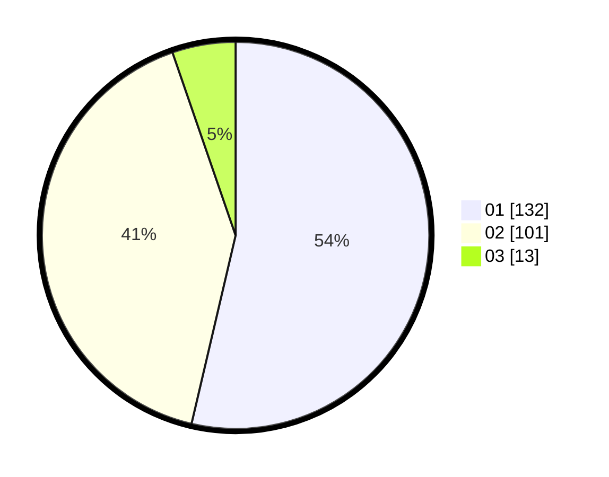

# Hasil

Hasil perolehan suara paslon dapat dilihat pada file paslon-01.txt, paslon-02.txt, dan paslon-03.txt.

Jika tidak ada, artinya data tersebut belum ada pada SIREKAP.

## Perolehan Suara

 * Paslon 01: **132**.
 * Paslon 02: **101**.
 * Paslon 03: **13**.

## Foto C Plano

https://sirekap-obj-formc.kpu.go.id/bdb7/pemilu/ppwp/31/75/10/10/04/3175101004050-20240215-215806--3e365863-24ef-42bd-84f6-49ad80e8aeda.jpg

https://sirekap-obj-formc.kpu.go.id/bdb7/pemilu/ppwp/31/75/10/10/04/3175101004050-20240215-215809--ea4a512a-e82a-46f6-aa3e-9a13a7b116ea.jpg

https://sirekap-obj-formc.kpu.go.id/bdb7/pemilu/ppwp/31/75/10/10/04/3175101004050-20240215-215807--9dfa6bc4-5eec-43fb-8928-0d5e975bc290.jpg

## DATA PEMILIH TETAP

Jumlah pemilih dalam DPT: **272**.
 * L: **126**.
 * P: **146**.

## DATA PENGGUNA HAK PILIH

Jumlah pengguna hak pilih dalam DPT: **233**.
 * L: **104**.
 * P: **129**.

Jumlah pengguna hak pilih dalam DPTb: **4**.
 * L: **3**.
 * P: **1**.

Jumlah pengguna hak pilih dalam DPK: **9**.
 * L: **4**.
 * P: **5**.

Jumlah pengguna hak pilih: **246**.
 * L: **111**.
 * P: **135**.

## JUMLAH SUARA SAH DAN TIDAK SAH

JUMLAH SELURUH SUARA SAH: **246**.

JUMLAH SUARA TIDAK SAH: **0**.

JUMLAH SELURUH SUARA SAH DAN SUARA TIDAK SAH: **246**.
