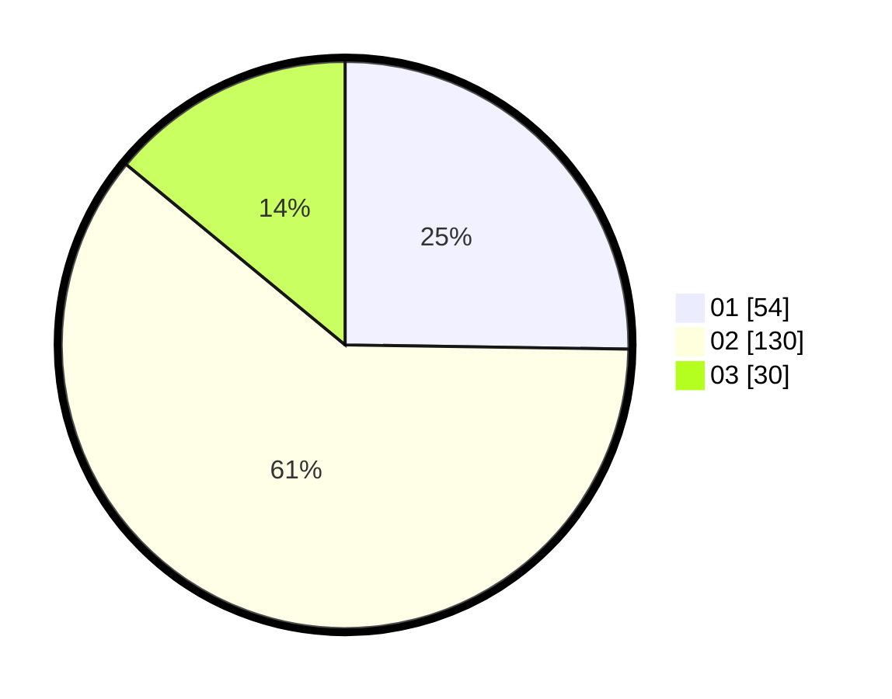

# Hasil

Hasil perolehan suara paslon dapat dilihat pada file paslon-01.txt, paslon-02.txt, dan paslon-03.txt.

Jika tidak ada, artinya data tersebut belum ada pada SIREKAP.

## Perolehan Suara

 * Paslon 01: **54**.
 * Paslon 02: **130**.
 * Paslon 03: **30**.

## Foto C Plano

https://sirekap-obj-formc.kpu.go.id/4e9c/pemilu/ppwp/31/75/10/10/04/3175101004058-20240215-003100--ad74d1e6-0899-4033-83c1-13bdebec9716.jpg

https://sirekap-obj-formc.kpu.go.id/4e9c/pemilu/ppwp/31/75/10/10/04/3175101004058-20240215-003123--abf280e9-289e-4929-be0f-b153fe8a1c78.jpg

https://sirekap-obj-formc.kpu.go.id/4e9c/pemilu/ppwp/31/75/10/10/04/3175101004058-20240215-003131--c4c8e51d-d215-4dc6-a186-40e1fc12de71.jpg
