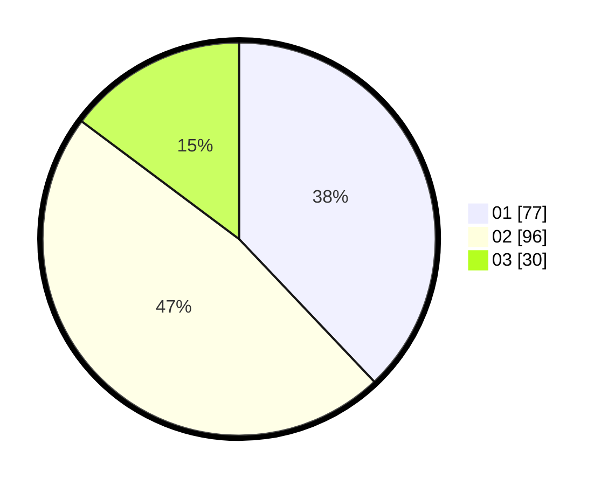

# Hasil

Hasil perolehan suara paslon dapat dilihat pada file paslon-01.txt, paslon-02.txt, dan paslon-03.txt.

Jika tidak ada, artinya data tersebut belum ada pada SIREKAP.

## Perolehan Suara

 * Paslon 01: **77**.
 * Paslon 02: **96**.
 * Paslon 03: **30**.

## Foto C Plano

https://sirekap-obj-formc.kpu.go.id/640f/pemilu/ppwp/31/75/10/10/04/3175101004062-20240214-220842--f499ec51-6988-4a04-88d7-7c3538068f3e.jpg

https://sirekap-obj-formc.kpu.go.id/640f/pemilu/ppwp/31/75/10/10/04/3175101004062-20240214-221018--d77085e0-8656-4207-adc5-3933683a6d42.jpg

https://sirekap-obj-formc.kpu.go.id/640f/pemilu/ppwp/31/75/10/10/04/3175101004062-20240214-221204--f2bbcd6a-a602-4683-a174-b2ca2f928b5f.jpg
