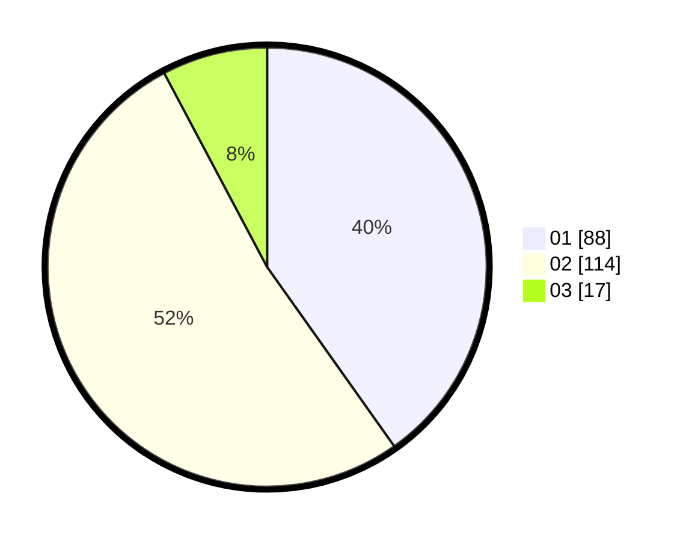

# Hasil

Hasil perolehan suara paslon dapat dilihat pada file paslon-01.txt, paslon-02.txt, dan paslon-03.txt.

Jika tidak ada, artinya data tersebut belum ada pada SIREKAP.

## Perolehan Suara

 * Paslon 01: **88**.
 * Paslon 02: **114**.
 * Paslon 03: **17**.

## Foto C Plano

https://sirekap-obj-formc.kpu.go.id/ab8f/pemilu/ppwp/31/75/10/10/04/3175101004063-20240216-144408--41b61d74-1969-414f-b5a1-9f19cfdac0b8.jpg

https://sirekap-obj-formc.kpu.go.id/ab8f/pemilu/ppwp/31/75/10/10/04/3175101004063-20240216-144409--9c754e84-ce71-4f07-8ffd-8a9356d87552.jpg

https://sirekap-obj-formc.kpu.go.id/ab8f/pemilu/ppwp/31/75/10/10/04/3175101004063-20240216-144408--06543135-2a2f-43af-a5a0-ac8a899c920e.jpg

## DATA PEMILIH TETAP

Jumlah pemilih dalam DPT: **260**.
 * L: **122**.
 * P: **138**.

## DATA PENGGUNA HAK PILIH

Jumlah pengguna hak pilih dalam DPT: **224**.
 * L: **109**.
 * P: **115**.

Jumlah pengguna hak pilih dalam DPTb: **1**.
 * L: **0**.
 * P: **1**.

Jumlah pengguna hak pilih dalam DPK: **0**.
 * L: **0**.
 * P: **0**.

Jumlah pengguna hak pilih: **225**.
 * L: **109**.
 * P: **116**.

## JUMLAH SUARA SAH DAN TIDAK SAH

JUMLAH SELURUH SUARA SAH: **219**.

JUMLAH SUARA TIDAK SAH: **6**.

JUMLAH SELURUH SUARA SAH DAN SUARA TIDAK SAH: **225**.
