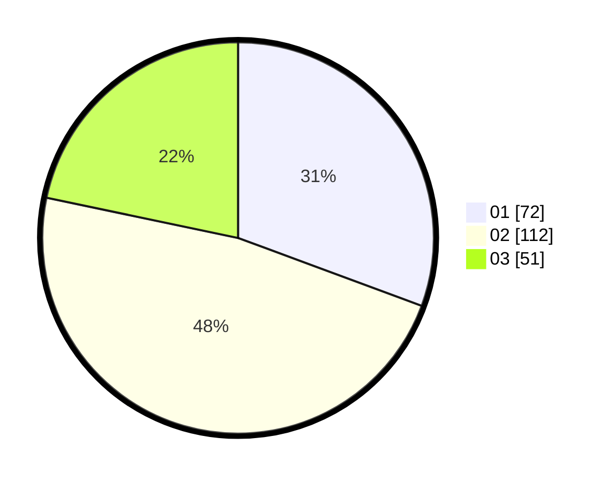

# Hasil

Hasil perolehan suara paslon dapat dilihat pada file paslon-01.txt, paslon-02.txt, dan paslon-03.txt.

Jika tidak ada, artinya data tersebut belum ada pada SIREKAP.

## Perolehan Suara

 * Paslon 01: **72**.
 * Paslon 02: **112**.
 * Paslon 03: **51**.

## Foto C Plano

https://sirekap-obj-formc.kpu.go.id/9c1b/pemilu/ppwp/31/75/10/10/04/3175101004066-20240214-193944--ed4ea05a-c62c-4538-9245-53d09a7d9c87.jpg

https://sirekap-obj-formc.kpu.go.id/9c1b/pemilu/ppwp/31/75/10/10/04/3175101004066-20240214-201035--1e38998a-6d6b-47c2-82c2-fb704a4206c1.jpg

https://sirekap-obj-formc.kpu.go.id/9c1b/pemilu/ppwp/31/75/10/10/04/3175101004066-20240214-193634--6ca2c897-d259-491d-8016-79e77851b7a3.jpg

## DATA PEMILIH TETAP

Jumlah pemilih dalam DPT: **277**.
 * L: **143**.
 * P: **134**.

## DATA PENGGUNA HAK PILIH

Jumlah pengguna hak pilih dalam DPT: **231**.
 * L: **113**.
 * P: **118**.

Jumlah pengguna hak pilih dalam DPTb: **0**.
 * L: **0**.
 * P: **0**.

Jumlah pengguna hak pilih dalam DPK: **5**.
 * L: **1**.
 * P: **4**.

Jumlah pengguna hak pilih: **236**.
 * L: **114**.
 * P: **122**.

## JUMLAH SUARA SAH DAN TIDAK SAH

JUMLAH SELURUH SUARA SAH: **235**.

JUMLAH SUARA TIDAK SAH: **1**.

JUMLAH SELURUH SUARA SAH DAN SUARA TIDAK SAH: **236**.
