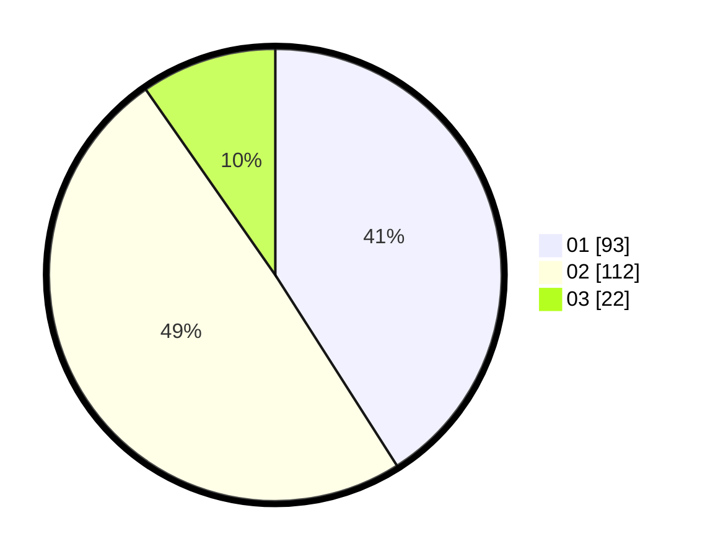

# Hasil

Hasil perolehan suara paslon dapat dilihat pada file paslon-01.txt, paslon-02.txt, dan paslon-03.txt.

Jika tidak ada, artinya data tersebut belum ada pada SIREKAP.

## Perolehan Suara

 * Paslon 01: **93**.
 * Paslon 02: **112**.
 * Paslon 03: **22**.

## Foto C Plano

https://sirekap-obj-formc.kpu.go.id/5dca/pemilu/ppwp/31/75/10/10/04/3175101004068-20240216-052346--7213b207-6296-4a99-8c21-62ce29fbf3c0.jpg

https://sirekap-obj-formc.kpu.go.id/5dca/pemilu/ppwp/31/75/10/10/04/3175101004068-20240216-053400--1ada3ae3-dbea-4577-a883-026b185879e8.jpg

https://sirekap-obj-formc.kpu.go.id/5dca/pemilu/ppwp/31/75/10/10/04/3175101004068-20240216-052352--14c7af5a-5a26-4ccc-82ad-279ad6e13ffe.jpg

## DATA PEMILIH TETAP

Jumlah pemilih dalam DPT: **233**.
 * L: **108**.
 * P: **125**.

## DATA PENGGUNA HAK PILIH

Jumlah pengguna hak pilih dalam DPT: **229**.
 * L: **107**.
 * P: **122**.

Jumlah pengguna hak pilih dalam DPTb: **1**.
 * L: **0**.
 * P: **1**.

Jumlah pengguna hak pilih dalam DPK: **3**.
 * L: **1**.
 * P: **2**.

Jumlah pengguna hak pilih: **233**.
 * L: **108**.
 * P: **125**.

## JUMLAH SUARA SAH DAN TIDAK SAH

JUMLAH SELURUH SUARA SAH: **227**.

JUMLAH SUARA TIDAK SAH: **6**.

JUMLAH SELURUH SUARA SAH DAN SUARA TIDAK SAH: **233**.
