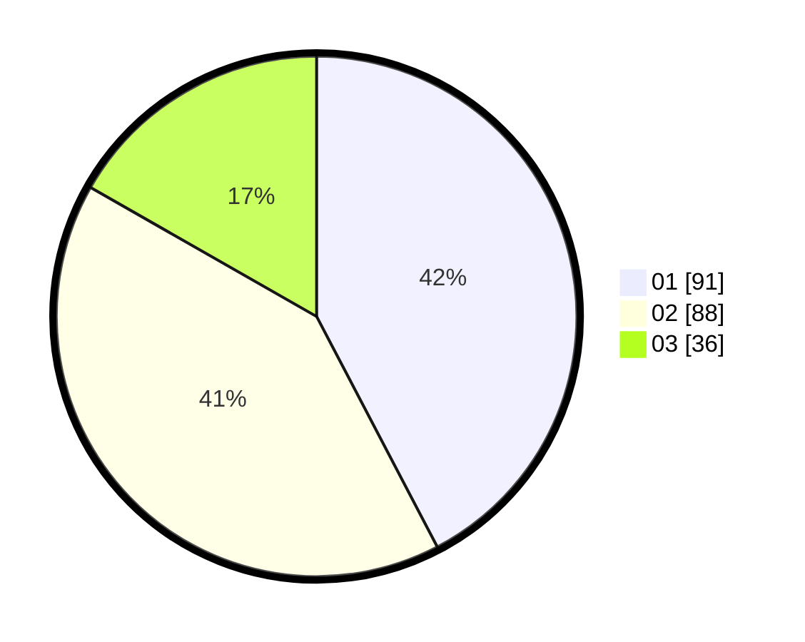

# Hasil

Hasil perolehan suara paslon dapat dilihat pada file paslon-01.txt, paslon-02.txt, dan paslon-03.txt.

Jika tidak ada, artinya data tersebut belum ada pada SIREKAP.

## Perolehan Suara

 * Paslon 01: **91**.
 * Paslon 02: **88**.
 * Paslon 03: **36**.

## Foto C Plano

https://sirekap-obj-formc.kpu.go.id/da50/pemilu/ppwp/31/75/10/10/04/3175101004074-20240216-010042--a0ad84d0-4c41-4b57-8e44-f46c9a69104c.jpg

https://sirekap-obj-formc.kpu.go.id/da50/pemilu/ppwp/31/75/10/10/04/3175101004074-20240216-010049--e1aa0d4d-ade9-4007-af9c-3c9ec612955b.jpg

https://sirekap-obj-formc.kpu.go.id/da50/pemilu/ppwp/31/75/10/10/04/3175101004074-20240216-010048--caf77787-e05a-49f8-bf0a-dddf5a305f92.jpg

## DATA PEMILIH TETAP

Jumlah pemilih dalam DPT: **273**.
 * L: **130**.
 * P: **143**.

## DATA PENGGUNA HAK PILIH

Jumlah pengguna hak pilih dalam DPT: **217**.
 * L: **96**.
 * P: **121**.

Jumlah pengguna hak pilih dalam DPTb: **0**.
 * L: **0**.
 * P: **0**.

Jumlah pengguna hak pilih dalam DPK: **3**.
 * L: **1**.
 * P: **2**.

Jumlah pengguna hak pilih: **220**.
 * L: **97**.
 * P: **123**.

## JUMLAH SUARA SAH DAN TIDAK SAH

JUMLAH SELURUH SUARA SAH: **215**.

JUMLAH SUARA TIDAK SAH: **5**.

JUMLAH SELURUH SUARA SAH DAN SUARA TIDAK SAH: **220**.
