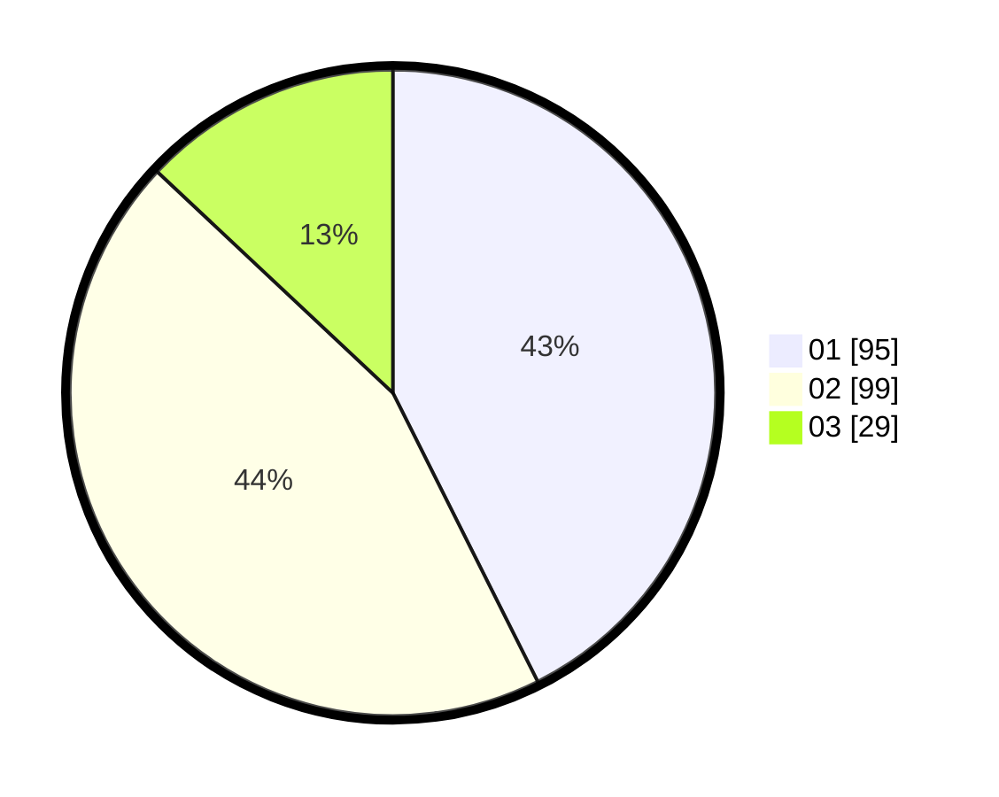

# Hasil

Hasil perolehan suara paslon dapat dilihat pada file paslon-01.txt, paslon-02.txt, dan paslon-03.txt.

Jika tidak ada, artinya data tersebut belum ada pada SIREKAP.

## Perolehan Suara

 * Paslon 01: **95**.
 * Paslon 02: **99**.
 * Paslon 03: **29**.

## Foto C Plano

https://sirekap-obj-formc.kpu.go.id/f1ff/pemilu/ppwp/31/75/10/10/04/3175101004075-20240216-012757--1d4ef01d-905d-42eb-9c2e-5562c0d6d449.jpg

https://sirekap-obj-formc.kpu.go.id/f1ff/pemilu/ppwp/31/75/10/10/04/3175101004075-20240216-012810--b2e2d97f-e7eb-4625-ad44-2af17fec26d0.jpg

https://sirekap-obj-formc.kpu.go.id/f1ff/pemilu/ppwp/31/75/10/10/04/3175101004075-20240216-012803--8a2e8027-8b4c-41e5-9833-c2b23cd259d9.jpg

## DATA PEMILIH TETAP

Jumlah pemilih dalam DPT: **282**.
 * L: **134**.
 * P: **148**.

## DATA PENGGUNA HAK PILIH

Jumlah pengguna hak pilih dalam DPT: **221**.
 * L: **105**.
 * P: **116**.

Jumlah pengguna hak pilih dalam DPTb: **3**.
 * L: **1**.
 * P: **2**.

Jumlah pengguna hak pilih dalam DPK: **1**.
 * L: **0**.
 * P: **1**.

Jumlah pengguna hak pilih: **225**.
 * L: **106**.
 * P: **119**.

## JUMLAH SUARA SAH DAN TIDAK SAH

JUMLAH SELURUH SUARA SAH: **223**.

JUMLAH SUARA TIDAK SAH: **2**.

JUMLAH SELURUH SUARA SAH DAN SUARA TIDAK SAH: **225**.
