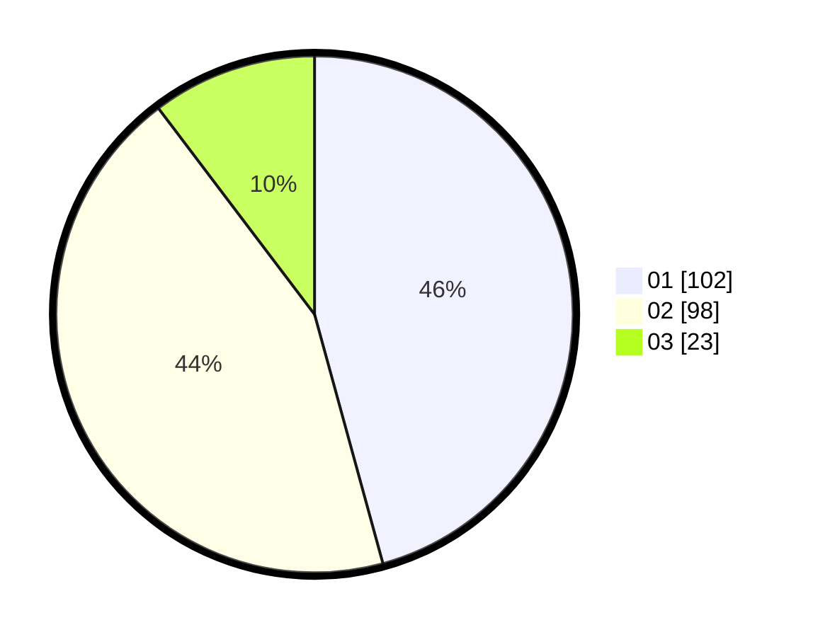

# Hasil

Hasil perolehan suara paslon dapat dilihat pada file paslon-01.txt, paslon-02.txt, dan paslon-03.txt.

Jika tidak ada, artinya data tersebut belum ada pada SIREKAP.

## Perolehan Suara

 * Paslon 01: **102**.
 * Paslon 02: **98**.
 * Paslon 03: **23**.

## Foto C Plano

https://sirekap-obj-formc.kpu.go.id/5e6e/pemilu/ppwp/31/75/10/10/05/3175101005001-20240214-155748--50d2d039-97bc-4e49-a1f1-adffb656f18f.jpg

https://sirekap-obj-formc.kpu.go.id/5e6e/pemilu/ppwp/31/75/10/10/05/3175101005001-20240214-155849--5be4e8c8-5994-44a8-b02c-c6e484cff80b.jpg

https://sirekap-obj-formc.kpu.go.id/5e6e/pemilu/ppwp/31/75/10/10/05/3175101005001-20240214-155921--befb385a-cc6a-433b-b717-767557c57512.jpg

## DATA PEMILIH TETAP

Jumlah pemilih dalam DPT: **267**.
 * L: **125**.
 * P: **142**.

## DATA PENGGUNA HAK PILIH

Jumlah pengguna hak pilih dalam DPT: **223**.
 * L: **105**.
 * P: **118**.

Jumlah pengguna hak pilih dalam DPTb: **1**.
 * L: **1**.
 * P: **0**.

Jumlah pengguna hak pilih dalam DPK: **1**.
 * L: **1**.
 * P: **0**.

Jumlah pengguna hak pilih: **225**.
 * L: **107**.
 * P: **118**.

## JUMLAH SUARA SAH DAN TIDAK SAH

JUMLAH SELURUH SUARA SAH: **223**.

JUMLAH SUARA TIDAK SAH: **2**.

JUMLAH SELURUH SUARA SAH DAN SUARA TIDAK SAH: **225**.
