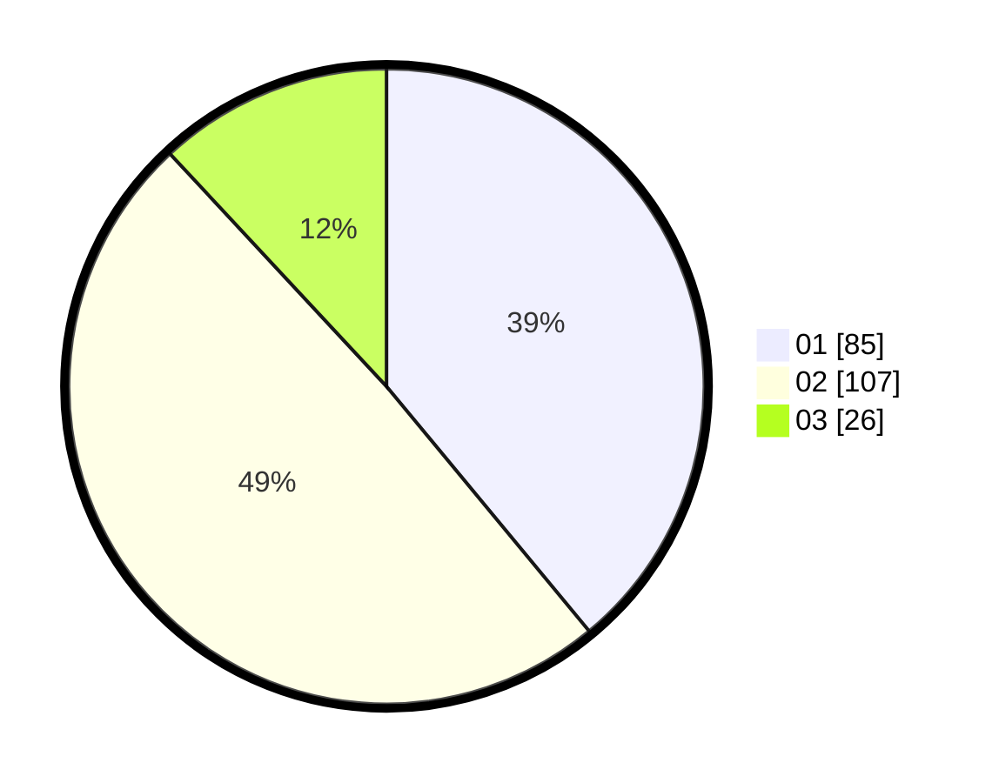

# Hasil

Hasil perolehan suara paslon dapat dilihat pada file paslon-01.txt, paslon-02.txt, dan paslon-03.txt.

Jika tidak ada, artinya data tersebut belum ada pada SIREKAP.

## Perolehan Suara

 * Paslon 01: **85**.
 * Paslon 02: **107**.
 * Paslon 03: **26**.

## Foto C Plano

https://sirekap-obj-formc.kpu.go.id/cc6a/pemilu/ppwp/31/75/10/10/05/3175101005004-20240216-143904--5857fd13-f15c-46e4-a1fd-49f66e15d41c.jpg

https://sirekap-obj-formc.kpu.go.id/cc6a/pemilu/ppwp/31/75/10/10/05/3175101005004-20240216-143905--e53aa7a3-d4cf-42f5-a367-af5109a8dd48.jpg

https://sirekap-obj-formc.kpu.go.id/cc6a/pemilu/ppwp/31/75/10/10/05/3175101005004-20240216-143905--015b2083-ef7c-4a0e-8a69-8aa379119535.jpg

## DATA PEMILIH TETAP

Jumlah pemilih dalam DPT: **267**.
 * L: **140**.
 * P: **127**.

## DATA PENGGUNA HAK PILIH

Jumlah pengguna hak pilih dalam DPT: **217**.
 * L: **110**.
 * P: **107**.

Jumlah pengguna hak pilih dalam DPTb: **3**.
 * L: **1**.
 * P: **2**.

Jumlah pengguna hak pilih dalam DPK: **4**.
 * L: **2**.
 * P: **2**.

Jumlah pengguna hak pilih: **224**.
 * L: **113**.
 * P: **111**.

## JUMLAH SUARA SAH DAN TIDAK SAH

JUMLAH SELURUH SUARA SAH: **218**.

JUMLAH SUARA TIDAK SAH: **6**.

JUMLAH SELURUH SUARA SAH DAN SUARA TIDAK SAH: **224**.
