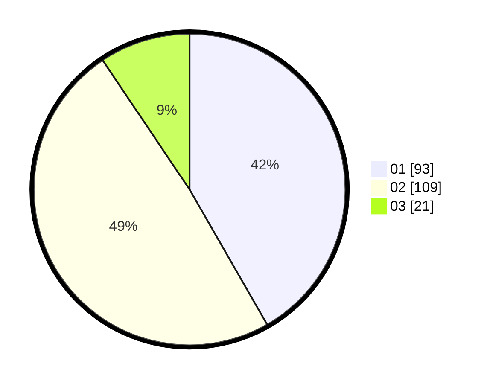

# Hasil

Hasil perolehan suara paslon dapat dilihat pada file paslon-01.txt, paslon-02.txt, dan paslon-03.txt.

Jika tidak ada, artinya data tersebut belum ada pada SIREKAP.

## Perolehan Suara

 * Paslon 01: **93**.
 * Paslon 02: **109**.
 * Paslon 03: **21**.

## Foto C Plano

https://sirekap-obj-formc.kpu.go.id/c968/pemilu/ppwp/31/75/10/10/05/3175101005006-20240216-150015--e5c9d193-6c3d-4a97-a592-3d7cb4e87a97.jpg

https://sirekap-obj-formc.kpu.go.id/c968/pemilu/ppwp/31/75/10/10/05/3175101005006-20240216-110357--a84f181d-8ce9-4e8f-a987-a6bd77a91813.jpg

https://sirekap-obj-formc.kpu.go.id/c968/pemilu/ppwp/31/75/10/10/05/3175101005006-20240216-110355--5cc5f77d-c4e9-47ab-88bb-f37b4aa086e1.jpg

## DATA PEMILIH TETAP

Jumlah pemilih dalam DPT: **267**.
 * L: **128**.
 * P: **139**.

## DATA PENGGUNA HAK PILIH

Jumlah pengguna hak pilih dalam DPT: **224**.
 * L: **107**.
 * P: **117**.

Jumlah pengguna hak pilih dalam DPTb: **6**.
 * L: **2**.
 * P: **4**.

Jumlah pengguna hak pilih dalam DPK: **2**.
 * L: **1**.
 * P: **1**.

Jumlah pengguna hak pilih: **232**.
 * L: **110**.
 * P: **122**.

## JUMLAH SUARA SAH DAN TIDAK SAH

JUMLAH SELURUH SUARA SAH: **223**.

JUMLAH SUARA TIDAK SAH: **9**.

JUMLAH SELURUH SUARA SAH DAN SUARA TIDAK SAH: **232**.
