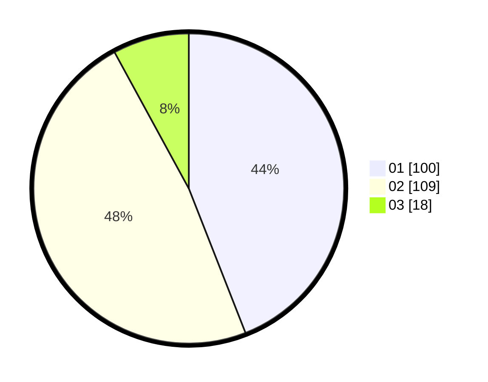

# Hasil

Hasil perolehan suara paslon dapat dilihat pada file paslon-01.txt, paslon-02.txt, dan paslon-03.txt.

Jika tidak ada, artinya data tersebut belum ada pada SIREKAP.

## Perolehan Suara

 * Paslon 01: **100**.
 * Paslon 02: **109**.
 * Paslon 03: **18**.

## Foto C Plano

https://sirekap-obj-formc.kpu.go.id/fb6c/pemilu/ppwp/31/75/10/10/05/3175101005009-20240216-045924--9a9ec81a-17b7-4752-b10b-fc41d29ca9cb.jpg

https://sirekap-obj-formc.kpu.go.id/fb6c/pemilu/ppwp/31/75/10/10/05/3175101005009-20240216-045927--ed358c9f-4350-4da5-bc9d-ffff900f3bab.jpg

https://sirekap-obj-formc.kpu.go.id/fb6c/pemilu/ppwp/31/75/10/10/05/3175101005009-20240216-045925--3ef48b19-0b93-40df-9b25-370a730cc2e6.jpg

## DATA PEMILIH TETAP

Jumlah pemilih dalam DPT: **0**.
 * L: **0**.
 * P: **0**.

## DATA PENGGUNA HAK PILIH

Jumlah pengguna hak pilih dalam DPT: **0**.
 * L: **0**.
 * P: **0**.

Jumlah pengguna hak pilih dalam DPTb: **0**.
 * L: **0**.
 * P: **0**.

Jumlah pengguna hak pilih dalam DPK: **0**.
 * L: **0**.
 * P: **0**.

Jumlah pengguna hak pilih: **0**.
 * L: **0**.
 * P: **0**.

## JUMLAH SUARA SAH DAN TIDAK SAH

JUMLAH SELURUH SUARA SAH: **227**.

JUMLAH SUARA TIDAK SAH: **3**.

JUMLAH SELURUH SUARA SAH DAN SUARA TIDAK SAH: **230**.
