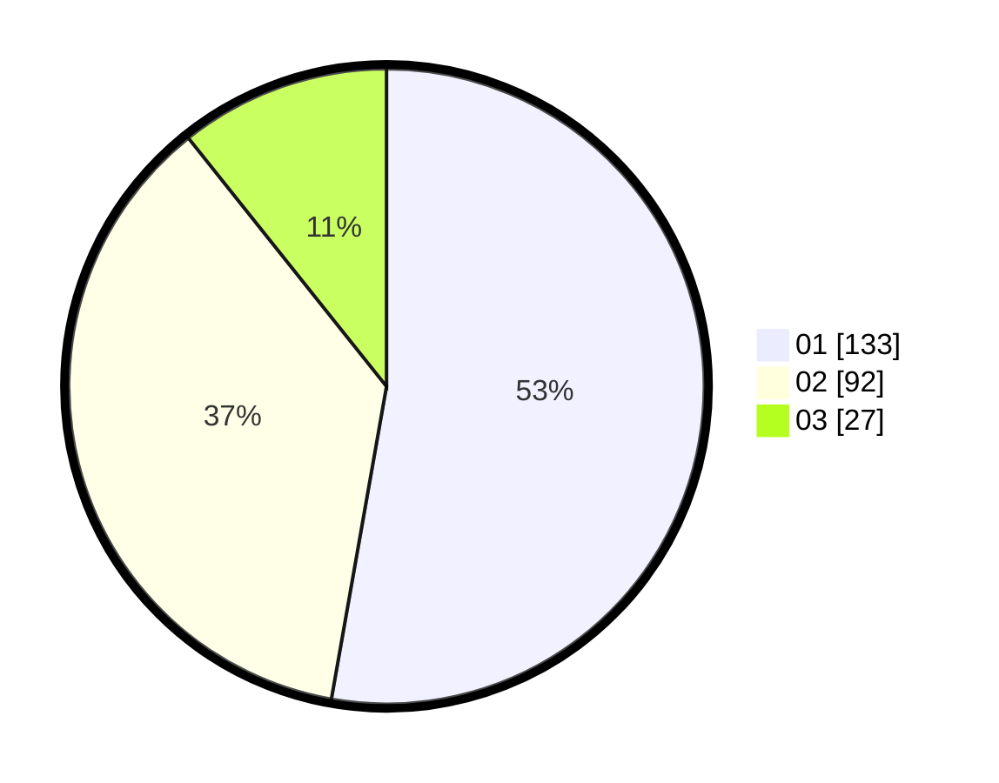

# Hasil

Hasil perolehan suara paslon dapat dilihat pada file paslon-01.txt, paslon-02.txt, dan paslon-03.txt.

Jika tidak ada, artinya data tersebut belum ada pada SIREKAP.

## Perolehan Suara

 * Paslon 01: **133**.
 * Paslon 02: **92**.
 * Paslon 03: **27**.

## Foto C Plano

https://sirekap-obj-formc.kpu.go.id/5bd4/pemilu/ppwp/31/75/10/10/05/3175101005020-20240215-221725--b640d9bd-ec4f-4909-a613-8c3cafff11dc.jpg

https://sirekap-obj-formc.kpu.go.id/5bd4/pemilu/ppwp/31/75/10/10/05/3175101005020-20240215-221728--6d33d306-950f-42ba-b2cf-95257b80a2f4.jpg

https://sirekap-obj-formc.kpu.go.id/5bd4/pemilu/ppwp/31/75/10/10/05/3175101005020-20240215-221727--21fb4cb8-6b53-4e4e-ab35-bc409fa2c649.jpg

## DATA PEMILIH TETAP

Jumlah pemilih dalam DPT: **298**.
 * L: **149**.
 * P: **149**.

## DATA PENGGUNA HAK PILIH

Jumlah pengguna hak pilih dalam DPT: **251**.
 * L: **120**.
 * P: **131**.

Jumlah pengguna hak pilih dalam DPTb: **8**.
 * L: **5**.
 * P: **3**.

Jumlah pengguna hak pilih dalam DPK: **0**.
 * L: **0**.
 * P: **0**.

Jumlah pengguna hak pilih: **259**.
 * L: **125**.
 * P: **134**.

## JUMLAH SUARA SAH DAN TIDAK SAH

JUMLAH SELURUH SUARA SAH: **252**.

JUMLAH SUARA TIDAK SAH: **7**.

JUMLAH SELURUH SUARA SAH DAN SUARA TIDAK SAH: **259**.
