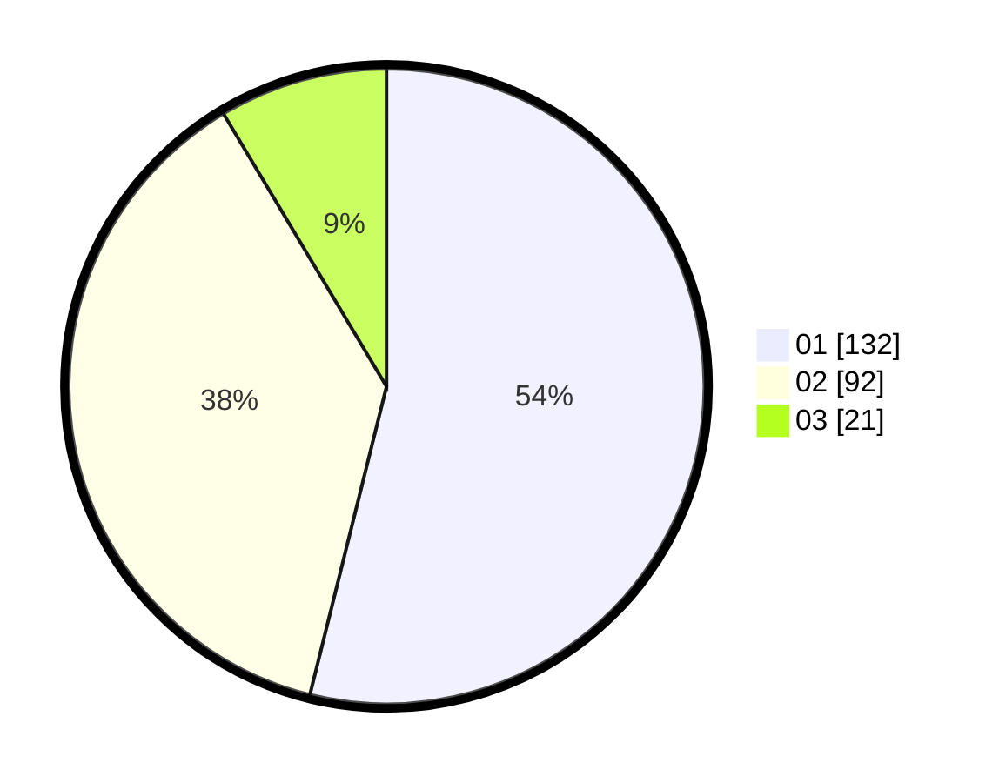

# Hasil

Hasil perolehan suara paslon dapat dilihat pada file paslon-01.txt, paslon-02.txt, dan paslon-03.txt.

Jika tidak ada, artinya data tersebut belum ada pada SIREKAP.

## Perolehan Suara

 * Paslon 01: **132**.
 * Paslon 02: **92**.
 * Paslon 03: **21**.

## Foto C Plano

https://sirekap-obj-formc.kpu.go.id/4dcb/pemilu/ppwp/31/75/10/10/05/3175101005023-20240214-225745--46d69b5f-9f03-426c-9a38-b14fc7ae0178.jpg

https://sirekap-obj-formc.kpu.go.id/4dcb/pemilu/ppwp/31/75/10/10/05/3175101005023-20240214-225929--d1160c1a-cc9d-4109-be47-0cf826d56622.jpg

https://sirekap-obj-formc.kpu.go.id/4dcb/pemilu/ppwp/31/75/10/10/05/3175101005023-20240214-230038--d14bd510-d073-45ea-a836-11309811f131.jpg
