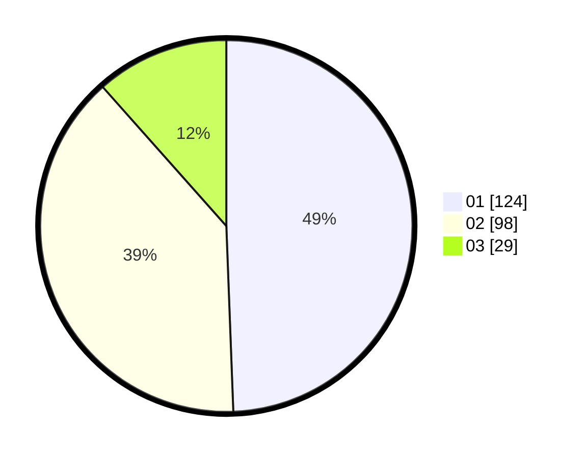

# Hasil

Hasil perolehan suara paslon dapat dilihat pada file paslon-01.txt, paslon-02.txt, dan paslon-03.txt.

Jika tidak ada, artinya data tersebut belum ada pada SIREKAP.

## Perolehan Suara

 * Paslon 01: **124**.
 * Paslon 02: **98**.
 * Paslon 03: **29**.

## Foto C Plano

https://sirekap-obj-formc.kpu.go.id/cda0/pemilu/ppwp/31/75/10/10/05/3175101005024-20240214-223535--d2f08d49-ae5b-44f0-a652-98cf2a3522b1.jpg

https://sirekap-obj-formc.kpu.go.id/cda0/pemilu/ppwp/31/75/10/10/05/3175101005024-20240214-223632--2cf8d86a-0ce2-4283-9c69-def1ca83582a.jpg

https://sirekap-obj-formc.kpu.go.id/cda0/pemilu/ppwp/31/75/10/10/05/3175101005024-20240215-011340--cb72d781-62c4-4220-abc6-7e06b25c860f.jpg
