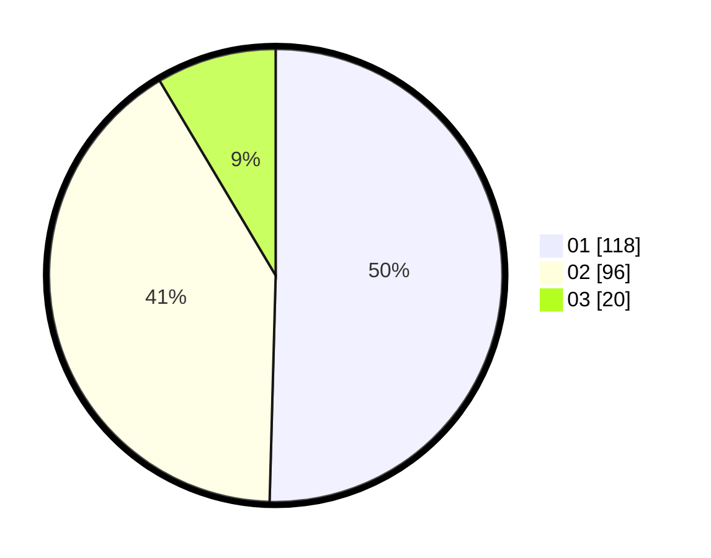

# Hasil

Hasil perolehan suara paslon dapat dilihat pada file paslon-01.txt, paslon-02.txt, dan paslon-03.txt.

Jika tidak ada, artinya data tersebut belum ada pada SIREKAP.

## Perolehan Suara

 * Paslon 01: **118**.
 * Paslon 02: **96**.
 * Paslon 03: **20**.

## Foto C Plano

https://sirekap-obj-formc.kpu.go.id/24fe/pemilu/ppwp/31/75/10/10/05/3175101005063-20240214-222828--c5f160ad-112a-48b3-8e27-7e3906f53ae9.jpg

https://sirekap-obj-formc.kpu.go.id/24fe/pemilu/ppwp/31/75/10/10/05/3175101005063-20240214-222950--6763ffd6-f6d3-4781-8cda-94e625663d17.jpg

https://sirekap-obj-formc.kpu.go.id/24fe/pemilu/ppwp/31/75/10/10/05/3175101005063-20240214-223053--f3a02cae-4ba9-4980-bb38-9283c58ad029.jpg
