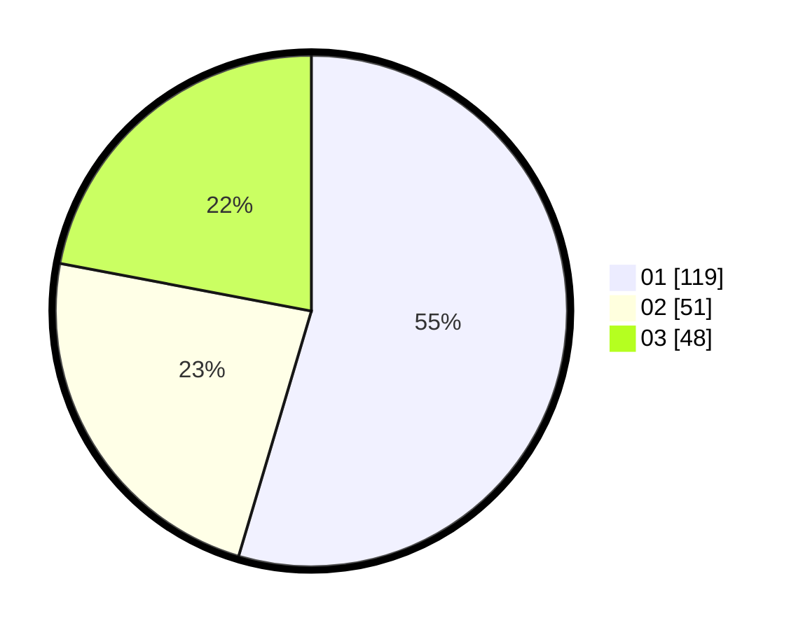

# Hasil

Hasil perolehan suara paslon dapat dilihat pada file paslon-01.txt, paslon-02.txt, dan paslon-03.txt.

Jika tidak ada, artinya data tersebut belum ada pada SIREKAP.

## Perolehan Suara

 * Paslon 01: **119**.
 * Paslon 02: **51**.
 * Paslon 03: **48**.

## Foto C Plano

https://sirekap-obj-formc.kpu.go.id/2c2b/pemilu/ppwp/31/75/10/10/05/3175101005067-20240214-224433--80398956-a458-4b82-8b88-d34652961f8d.jpg

https://sirekap-obj-formc.kpu.go.id/2c2b/pemilu/ppwp/31/75/10/10/05/3175101005067-20240214-224528--5a61cec0-fdcb-4ccc-93cd-8baaa20b2890.jpg

https://sirekap-obj-formc.kpu.go.id/2c2b/pemilu/ppwp/31/75/10/10/05/3175101005067-20240214-224604--284350f2-a288-44c8-8457-fdbf9cac4dd5.jpg
