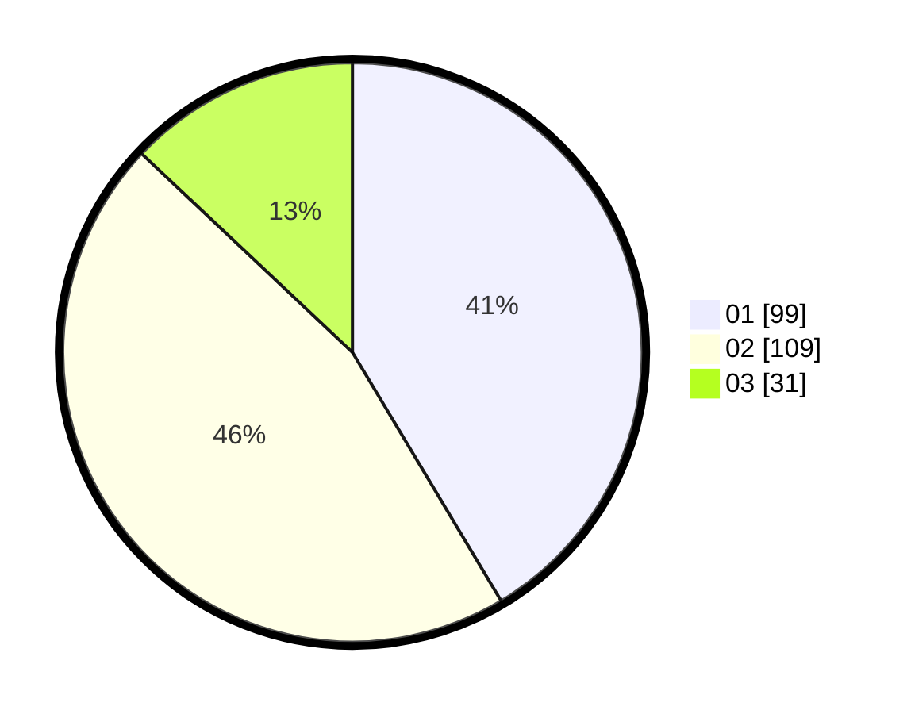

# Hasil

Hasil perolehan suara paslon dapat dilihat pada file paslon-01.txt, paslon-02.txt, dan paslon-03.txt.

Jika tidak ada, artinya data tersebut belum ada pada SIREKAP.

## Perolehan Suara

 * Paslon 01: **99**.
 * Paslon 02: **109**.
 * Paslon 03: **31**.

## Foto C Plano

https://sirekap-obj-formc.kpu.go.id/b34a/pemilu/ppwp/31/75/10/10/06/3175101006008-20240214-214157--36d1978c-729a-4f36-abe8-193049cfbcc0.jpg

https://sirekap-obj-formc.kpu.go.id/b34a/pemilu/ppwp/31/75/10/10/06/3175101006008-20240214-214211--812b70b9-f8ac-4999-8b88-b51c83ccec74.jpg

https://sirekap-obj-formc.kpu.go.id/b34a/pemilu/ppwp/31/75/10/10/06/3175101006008-20240214-214225--b5bc0516-de8d-4a46-99ef-9e77cb2e1577.jpg

## DATA PEMILIH TETAP

Jumlah pemilih dalam DPT: **278**.
 * L: **131**.
 * P: **147**.

## DATA PENGGUNA HAK PILIH

Jumlah pengguna hak pilih dalam DPT: **235**.
 * L: **113**.
 * P: **122**.

Jumlah pengguna hak pilih dalam DPTb: **0**.
 * L: **0**.
 * P: **0**.

Jumlah pengguna hak pilih dalam DPK: **6**.
 * L: **3**.
 * P: **3**.

Jumlah pengguna hak pilih: **241**.
 * L: **116**.
 * P: **125**.

## JUMLAH SUARA SAH DAN TIDAK SAH

JUMLAH SELURUH SUARA SAH: **239**.

JUMLAH SUARA TIDAK SAH: **2**.

JUMLAH SELURUH SUARA SAH DAN SUARA TIDAK SAH: **241**.
