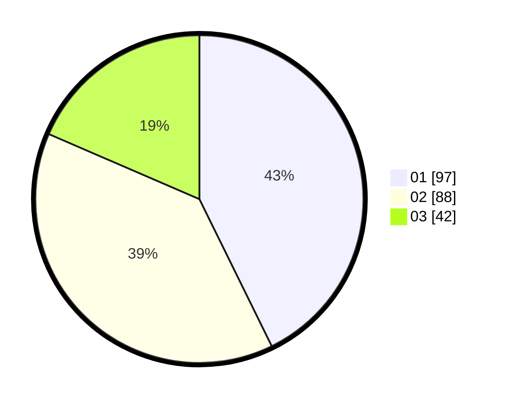

# Hasil

Hasil perolehan suara paslon dapat dilihat pada file paslon-01.txt, paslon-02.txt, dan paslon-03.txt.

Jika tidak ada, artinya data tersebut belum ada pada SIREKAP.

## Perolehan Suara

 * Paslon 01: **97**.
 * Paslon 02: **88**.
 * Paslon 03: **42**.

## Foto C Plano

https://sirekap-obj-formc.kpu.go.id/0489/pemilu/ppwp/31/75/10/10/06/3175101006018-20240215-004504--b212f813-445d-45d9-b60f-c5d38c8ee2e6.jpg

https://sirekap-obj-formc.kpu.go.id/0489/pemilu/ppwp/31/75/10/10/06/3175101006018-20240215-004618--4ed9db68-e455-4ef6-ae84-4b4058ab06ae.jpg

https://sirekap-obj-formc.kpu.go.id/0489/pemilu/ppwp/31/75/10/10/06/3175101006018-20240215-004746--854a2dc3-771c-4ca5-a650-f20bfc10401f.jpg
