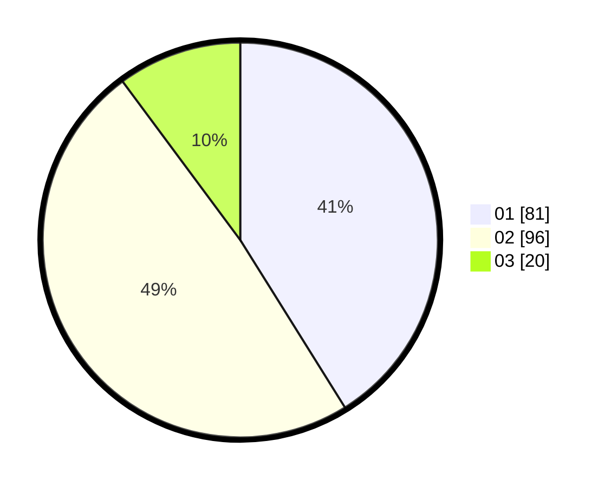

# Hasil

Hasil perolehan suara paslon dapat dilihat pada file paslon-01.txt, paslon-02.txt, dan paslon-03.txt.

Jika tidak ada, artinya data tersebut belum ada pada SIREKAP.

## Perolehan Suara

 * Paslon 01: **81**.
 * Paslon 02: **96**.
 * Paslon 03: **20**.

## Foto C Plano

https://sirekap-obj-formc.kpu.go.id/15cd/pemilu/ppwp/31/75/10/10/06/3175101006029-20240214-220620--eafc4e26-46a1-419d-bd90-9df1be0a8006.jpg

https://sirekap-obj-formc.kpu.go.id/15cd/pemilu/ppwp/31/75/10/10/06/3175101006029-20240214-220626--abc9ccb6-eb24-4533-b6fd-822f40ffed1b.jpg

https://sirekap-obj-formc.kpu.go.id/15cd/pemilu/ppwp/31/75/10/10/06/3175101006029-20240214-220636--72d84b2c-207b-4e37-8aa0-ddeb4cc47646.jpg

## DATA PEMILIH TETAP

Jumlah pemilih dalam DPT: **247**.
 * L: **101**.
 * P: **146**.

## DATA PENGGUNA HAK PILIH

Jumlah pengguna hak pilih dalam DPT: **196**.
 * L: **79**.
 * P: **117**.

Jumlah pengguna hak pilih dalam DPTb: **2**.
 * L: **1**.
 * P: **1**.

Jumlah pengguna hak pilih dalam DPK: **3**.
 * L: **1**.
 * P: **2**.

Jumlah pengguna hak pilih: **201**.
 * L: **81**.
 * P: **120**.

## JUMLAH SUARA SAH DAN TIDAK SAH

JUMLAH SELURUH SUARA SAH: **197**.

JUMLAH SUARA TIDAK SAH: **4**.

JUMLAH SELURUH SUARA SAH DAN SUARA TIDAK SAH: **201**.
