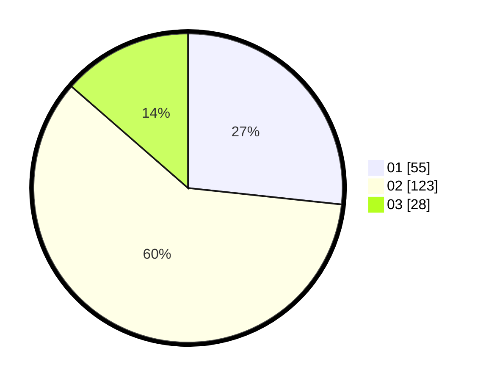

# Hasil

Hasil perolehan suara paslon dapat dilihat pada file paslon-01.txt, paslon-02.txt, dan paslon-03.txt.

Jika tidak ada, artinya data tersebut belum ada pada SIREKAP.

## Perolehan Suara

 * Paslon 01: **55**.
 * Paslon 02: **123**.
 * Paslon 03: **28**.

## Foto C Plano

https://sirekap-obj-formc.kpu.go.id/beef/pemilu/ppwp/31/75/10/10/06/3175101006036-20240214-162217--63326747-4a8c-4ecd-81a7-c25e2f6f47a1.jpg

https://sirekap-obj-formc.kpu.go.id/beef/pemilu/ppwp/31/75/10/10/06/3175101006036-20240214-162224--ae685247-aa5f-4e1c-ad5b-b89faa4d5730.jpg

https://sirekap-obj-formc.kpu.go.id/beef/pemilu/ppwp/31/75/10/10/06/3175101006036-20240214-162227--a7c90102-2dff-4845-a4f5-727844956bea.jpg

## DATA PEMILIH TETAP

Jumlah pemilih dalam DPT: **260**.
 * L: **130**.
 * P: **130**.

## DATA PENGGUNA HAK PILIH

Jumlah pengguna hak pilih dalam DPT: **207**.
 * L: **101**.
 * P: **106**.

Jumlah pengguna hak pilih dalam DPTb: **0**.
 * L: **0**.
 * P: **0**.

Jumlah pengguna hak pilih dalam DPK: **2**.
 * L: **0**.
 * P: **2**.

Jumlah pengguna hak pilih: **209**.
 * L: **101**.
 * P: **108**.

## JUMLAH SUARA SAH DAN TIDAK SAH

JUMLAH SELURUH SUARA SAH: **206**.

JUMLAH SUARA TIDAK SAH: **3**.

JUMLAH SELURUH SUARA SAH DAN SUARA TIDAK SAH: **209**.
