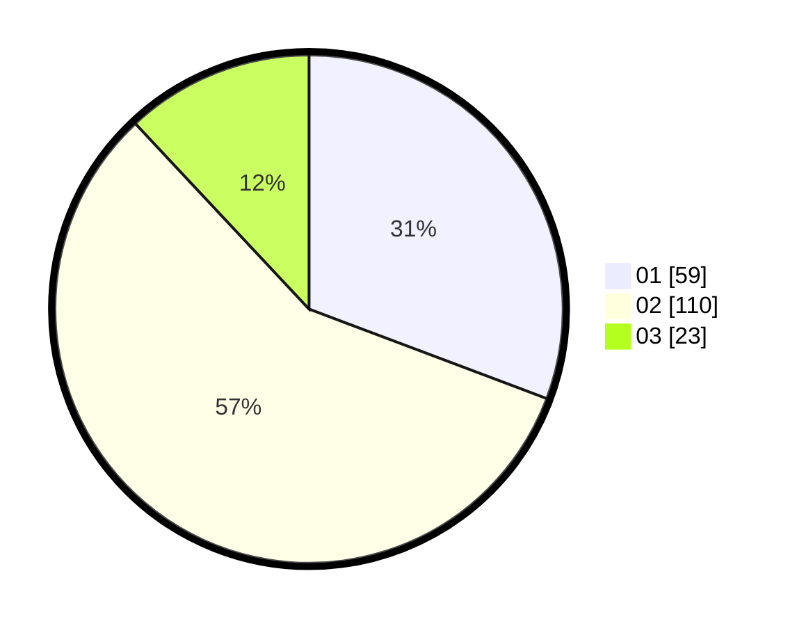

# Hasil

Hasil perolehan suara paslon dapat dilihat pada file paslon-01.txt, paslon-02.txt, dan paslon-03.txt.

Jika tidak ada, artinya data tersebut belum ada pada SIREKAP.

## Perolehan Suara

 * Paslon 01: **59**.
 * Paslon 02: **110**.
 * Paslon 03: **23**.

## Foto C Plano

https://sirekap-obj-formc.kpu.go.id/2ac6/pemilu/ppwp/31/75/10/10/06/3175101006038-20240214-193109--a8601126-1d8d-40ab-be5d-84ed7a35553d.jpg

https://sirekap-obj-formc.kpu.go.id/2ac6/pemilu/ppwp/31/75/10/10/06/3175101006038-20240214-193127--7fd48082-d761-4daa-962d-a7f9501bb455.jpg

https://sirekap-obj-formc.kpu.go.id/2ac6/pemilu/ppwp/31/75/10/10/06/3175101006038-20240214-193143--8bf44617-1c6a-47b0-b1d1-8416be82a635.jpg

## DATA PEMILIH TETAP

Jumlah pemilih dalam DPT: **260**.
 * L: **128**.
 * P: **132**.

## DATA PENGGUNA HAK PILIH

Jumlah pengguna hak pilih dalam DPT: **195**.
 * L: **94**.
 * P: **101**.

Jumlah pengguna hak pilih dalam DPTb: **0**.
 * L: **0**.
 * P: **0**.

Jumlah pengguna hak pilih dalam DPK: **3**.
 * L: **2**.
 * P: **1**.

Jumlah pengguna hak pilih: **198**.
 * L: **96**.
 * P: **102**.

## JUMLAH SUARA SAH DAN TIDAK SAH

JUMLAH SELURUH SUARA SAH: **192**.

JUMLAH SUARA TIDAK SAH: **6**.

JUMLAH SELURUH SUARA SAH DAN SUARA TIDAK SAH: **198**.
