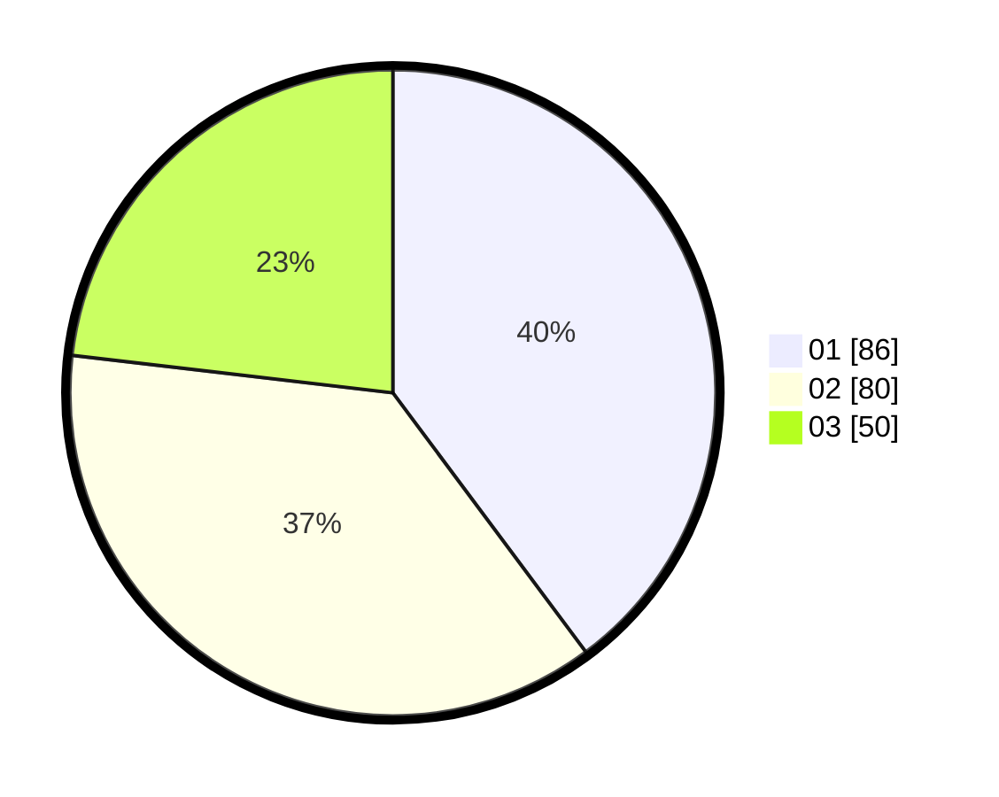

# Hasil

Hasil perolehan suara paslon dapat dilihat pada file paslon-01.txt, paslon-02.txt, dan paslon-03.txt.

Jika tidak ada, artinya data tersebut belum ada pada SIREKAP.

## Perolehan Suara

 * Paslon 01: **86**.
 * Paslon 02: **80**.
 * Paslon 03: **50**.

## Foto C Plano

https://sirekap-obj-formc.kpu.go.id/ba77/pemilu/ppwp/31/75/10/10/06/3175101006050-20240214-205507--cf007587-5571-4075-ab50-485fcf71a970.jpg

https://sirekap-obj-formc.kpu.go.id/ba77/pemilu/ppwp/31/75/10/10/06/3175101006050-20240214-205800--8485e295-7603-4238-8793-b8d99deca471.jpg

https://sirekap-obj-formc.kpu.go.id/ba77/pemilu/ppwp/31/75/10/10/06/3175101006050-20240214-225717--fa9064ee-165c-462b-ba23-da784e2502bb.jpg
