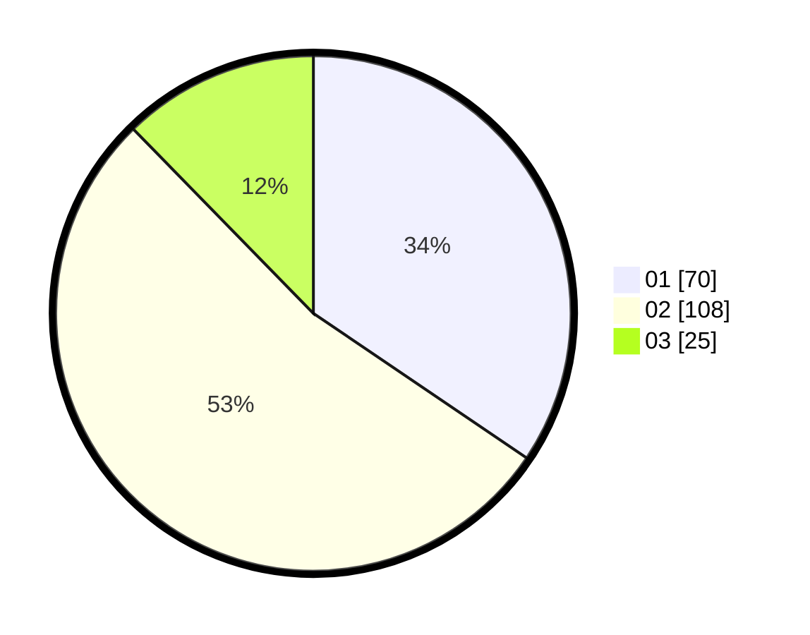

# Hasil

Hasil perolehan suara paslon dapat dilihat pada file paslon-01.txt, paslon-02.txt, dan paslon-03.txt.

Jika tidak ada, artinya data tersebut belum ada pada SIREKAP.

## Perolehan Suara

 * Paslon 01: **70**.
 * Paslon 02: **108**.
 * Paslon 03: **25**.

## Foto C Plano

https://sirekap-obj-formc.kpu.go.id/e8b6/pemilu/ppwp/31/75/10/10/06/3175101006051-20240216-035733--f4d539c8-fa15-46ba-91a8-4adba2a8a616.jpg

https://sirekap-obj-formc.kpu.go.id/e8b6/pemilu/ppwp/31/75/10/10/06/3175101006051-20240216-035735--2d93d76c-feca-46d9-ac1a-66d112da2d39.jpg

https://sirekap-obj-formc.kpu.go.id/e8b6/pemilu/ppwp/31/75/10/10/06/3175101006051-20240216-035023--36765fad-9363-4e22-a7dd-9abf64d14486.jpg

## DATA PEMILIH TETAP

Jumlah pemilih dalam DPT: **0**.
 * L: **0**.
 * P: **0**.

## DATA PENGGUNA HAK PILIH

Jumlah pengguna hak pilih dalam DPT: **0**.
 * L: **0**.
 * P: **0**.

Jumlah pengguna hak pilih dalam DPTb: **0**.
 * L: **0**.
 * P: **0**.

Jumlah pengguna hak pilih dalam DPK: **0**.
 * L: **0**.
 * P: **0**.

Jumlah pengguna hak pilih: **0**.
 * L: **0**.
 * P: **0**.

## JUMLAH SUARA SAH DAN TIDAK SAH

JUMLAH SELURUH SUARA SAH: **203**.

JUMLAH SUARA TIDAK SAH: **3**.

JUMLAH SELURUH SUARA SAH DAN SUARA TIDAK SAH: **206**.
