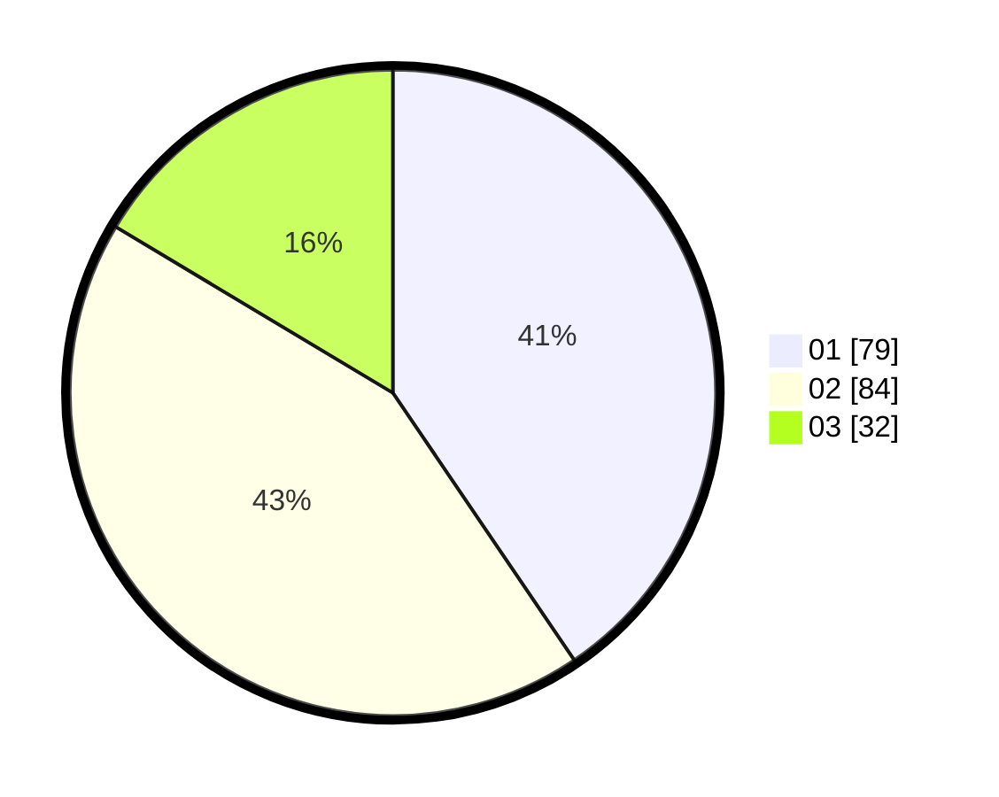

# Hasil

Hasil perolehan suara paslon dapat dilihat pada file paslon-01.txt, paslon-02.txt, dan paslon-03.txt.

Jika tidak ada, artinya data tersebut belum ada pada SIREKAP.

## Perolehan Suara

 * Paslon 01: **79**.
 * Paslon 02: **84**.
 * Paslon 03: **32**.

## Foto C Plano

https://sirekap-obj-formc.kpu.go.id/92f7/pemilu/ppwp/31/75/10/10/06/3175101006064-20240216-013636--9d4440eb-e2f0-4f6c-832b-2dab136c020c.jpg

https://sirekap-obj-formc.kpu.go.id/92f7/pemilu/ppwp/31/75/10/10/06/3175101006064-20240216-013645--2f5ac5c0-ab18-46f2-b306-d94b995e52f8.jpg

https://sirekap-obj-formc.kpu.go.id/92f7/pemilu/ppwp/31/75/10/10/06/3175101006064-20240216-013644--a958b930-36be-435a-9e6e-8143df43b36f.jpg

## DATA PEMILIH TETAP

Jumlah pemilih dalam DPT: **260**.
 * L: **129**.
 * P: **131**.

## DATA PENGGUNA HAK PILIH

Jumlah pengguna hak pilih dalam DPT: **195**.
 * L: **92**.
 * P: **103**.

Jumlah pengguna hak pilih dalam DPTb: **0**.
 * L: **0**.
 * P: **0**.

Jumlah pengguna hak pilih dalam DPK: **0**.
 * L: **0**.
 * P: **0**.

Jumlah pengguna hak pilih: **195**.
 * L: **92**.
 * P: **103**.

## JUMLAH SUARA SAH DAN TIDAK SAH

JUMLAH SELURUH SUARA SAH: **195**.

JUMLAH SUARA TIDAK SAH: **0**.

JUMLAH SELURUH SUARA SAH DAN SUARA TIDAK SAH: **195**.
